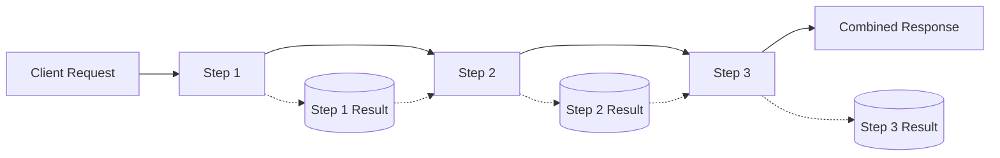

# Composite Endpoints

Composite endpoints in Portway allow you to orchestrate multiple API calls into a single transaction. These endpoints are built on top of the proxy system and enable complex operations that span multiple services, with automatic data passing between steps.

## Overview

Composite endpoints enable you to:
- Execute multiple API calls in a defined sequence
- Pass data between steps automatically
- Handle array operations for batch processing
- Manage complex transactions as a single operation
- Rollback on failure (when supported by target services)

:::warning Important
Composite endpoints require existing proxy endpoints to function. Each step in a composite operation must reference a configured proxy endpoint.
:::

## Architecture

```mermaid
graph TD
    A[Client Request] --> B[Composite Endpoint]
    B --> C[Step 1: CreateOrderLines]
    B --> D[Step 2: CreateOrderHeader]
    
    C --> E[Proxy: OrderLine Endpoint]
    D --> F[Proxy: OrderHeader Endpoint]
    
    E --> G[Internal Service]
    F --> G
    
    G --> H[Combined Response]
    H --> I[Client]
    
    style B fill:#f9f,stroke:#333,stroke-width:4px
    style C fill:#bbf,stroke:#333,stroke-width:2px
    style D fill:#bbf,stroke:#333,stroke-width:2px
    style E fill:#bfb,stroke:#333,stroke-width:2px
    style F fill:#bfb,stroke:#333,stroke-width:2px
    style G fill:#fbb,stroke:#333,stroke-width:2px
  ```

## Configuration

### Basic Composite Configuration

Create a JSON file in the `endpoints/Proxy/{CompositeName}/entity.json` directory:

```json
{
  "Type": "Composite",
  "Url": "http://internal-service/api",
  "Methods": ["POST"],
  "CompositeConfig": {
    "Name": "CreateOrder",
    "Description": "Creates a complete order with header and lines",
    "Steps": [
      {
        "Name": "CreateOrderLines",
        "Endpoint": "OrderLine",
        "Method": "POST",
        "IsArray": true,
        "ArrayProperty": "Lines",
        "TemplateTransformations": {
          "TransactionKey": "$guid"
        }
      },
      {
        "Name": "CreateOrderHeader",
        "Endpoint": "OrderHeader", 
        "Method": "POST",
        "SourceProperty": "Header",
        "TemplateTransformations": {
          "TransactionKey": "$prev.CreateOrderLines.0.d.TransactionKey"
        }
      }
    ]
  }
}
```

### Configuration Properties

| Property | Type | Required | Description |
|----------|------|----------|-------------|
| `Type` | string | Yes | Must be "Composite" |
| `Url` | string | Yes | Base URL for all steps |
| `Methods` | array | Yes | Supported HTTP methods (usually ["POST"]) |
| `CompositeConfig` | object | Yes | Composite operation configuration |

### CompositeConfig Properties

| Property | Type | Required | Description |
|----------|------|----------|-------------|
| `Name` | string | Yes | Name of the composite operation |
| `Description` | string | No | Description of what the operation does |
| `Steps` | array | Yes | Array of steps to execute |

### Step Properties

| Property | Type | Required | Description |
|----------|------|----------|-------------|
| `Name` | string | Yes | Unique name for the step |
| `Endpoint` | string | Yes | Proxy endpoint to call |
| `Method` | string | Yes | HTTP method to use |
| `IsArray` | boolean | No | If true, processes array of items |
| `ArrayProperty` | string | If IsArray | Property containing array data |
| `SourceProperty` | string | No | Source property from request data |
| `TemplateTransformations` | object | No | Data transformations to apply |

## How Composite Endpoints Work

### 1. Request Processing

When a request arrives at a composite endpoint:

1. The request body is parsed
2. Each step is executed in sequence
3. Data can be transformed between steps
4. Results are combined into a single response

### 2. Data Flow

Data flows through the composite operation:



### 3. Array Processing

When `IsArray` is true, the step processes each item individually:

```json
{
  "Lines": [
    {"product": "A", "quantity": 2},
    {"product": "B", "quantity": 1}
  ]
}
```

Each array item is sent as a separate request to the endpoint.

## Template Transformations

Template transformations allow dynamic data manipulation between steps:

### Transformation Types

| Template | Description | Example |
|----------|-------------|---------|
| `$guid` | Generates a new GUID | `"Id": "$guid"` |
| `$requestid` | Uses the request ID | `"RequestId": "$requestid"` |
| `$prev.StepName.property` | References previous step result | `"OrderId": "$prev.CreateOrder.id"` |
| `$context.variable` | References context variable | `"UserId": "$context.userId"` |

### Using Previous Step Data

Access nested data from previous steps:

```json
{
  "TemplateTransformations": {
    "TransactionKey": "$prev.CreateOrderLines.0.d.TransactionKey",
    "TotalAmount": "$prev.CalculateTotal.result.amount"
  }
}
```

## Examples

### Sales Order Creation

```json
{
  "Type": "Composite",
  "Url": "http://erp-service/api",
  "Methods": ["POST"],
  "CompositeConfig": {
    "Name": "SalesOrder",
    "Description": "Creates a complete sales order",
    "Steps": [
      {
        "Name": "CreateOrderLines",
        "Endpoint": "SalesOrderLine",
        "Method": "POST",
        "IsArray": true,
        "ArrayProperty": "Lines",
        "TemplateTransformations": {
          "TransactionKey": "$guid"
        }
      },
      {
        "Name": "CreateOrderHeader",
        "Endpoint": "SalesOrderHeader",
        "Method": "POST",
        "SourceProperty": "Header",
        "TemplateTransformations": {
          "TransactionKey": "$prev.CreateOrderLines.0.d.TransactionKey",
          "LineCount": "$prev.CreateOrderLines.length"
        }
      }
    ]
  }
}
```

### Multi-Service Operation

```json
{
  "Type": "Composite",
  "CompositeConfig": {
    "Name": "ProcessOrder",
    "Steps": [
      {
        "Name": "ValidateCustomer",
        "Endpoint": "CustomerService",
        "Method": "POST",
        "SourceProperty": "customer"
      },
      {
        "Name": "CheckInventory",
        "Endpoint": "InventoryService",
        "Method": "POST",
        "SourceProperty": "items"
      },
      {
        "Name": "CreateOrder",
        "Endpoint": "OrderService",
        "Method": "POST",
        "TemplateTransformations": {
          "customerId": "$prev.ValidateCustomer.id",
          "availableItems": "$prev.CheckInventory.available"
        }
      }
    ]
  }
}
```

## Request Format

### Basic Request

```http
POST /api/prod/composite/SalesOrder
Content-Type: application/json
Authorization: Bearer <token>

{
  "Header": {
    "CustomerCode": "CUST001",
    "OrderDate": "2024-03-15",
    "Reference": "PO-12345"
  },
  "Lines": [
    {
      "ProductCode": "PROD001",
      "Quantity": 5,
      "Price": 99.99
    },
    {
      "ProductCode": "PROD002", 
      "Quantity": 3,
      "Price": 149.99
    }
  ]
}
```

### Response Format

```json
{
  "Success": true,
  "StepResults": {
    "CreateOrderLines": [
      {
        "d": {
          "TransactionKey": "abc-123",
          "LineNumber": 1,
          "ProductCode": "PROD001"
        }
      },
      {
        "d": {
          "TransactionKey": "abc-123",
          "LineNumber": 2,
          "ProductCode": "PROD002"
        }
      }
    ],
    "CreateOrderHeader": {
      "d": {
        "OrderNumber": "SO-001234",
        "TransactionKey": "abc-123",
        "Status": "Created"
      }
    }
  }
}
```

## Error Handling

### Step Failure

If any step fails, the entire operation stops:

```json
{
  "Success": false,
  "ErrorStep": "CreateOrderHeader",
  "ErrorMessage": "Insufficient credit limit",
  "ErrorDetail": "Customer credit limit exceeded",
  "StatusCode": 400,
  "StepResults": {
    "CreateOrderLines": [
      // Results from successful steps
    ]
  }
}
```

### Error Response Fields

| Field | Description |
|-------|-------------|
| `Success` | Whether the operation completed successfully |
| `ErrorStep` | Which step failed |
| `ErrorMessage` | Brief error description |
| `ErrorDetail` | Detailed error information |
| `StatusCode` | HTTP status code from the failed request |
| `StepResults` | Results from steps that completed before failure |

:::warning Transaction Support
Composite endpoints do not provide automatic transaction rollback. If a step fails, previously completed steps remain committed. Design your operations with this limitation in mind.
:::

## Best Practices

### 1. Design for Idempotency

Make operations idempotent where possible:
- Use consistent transaction keys
- Check for existing records before creating
- Design steps to be safely re-runnable

### 2. Handle Partial Failures

Plan for scenarios where some steps succeed and others fail:
- Log all step results
- Implement cleanup procedures
- Provide clear error information

### 3. Keep Steps Focused

Each step should have a single responsibility:
- Avoid complex logic within steps
- Use multiple steps for complex operations
- Keep data transformations simple

### 4. Use Meaningful Names

Choose descriptive names for steps and properties:
```json
{
  "Name": "ValidateOrderData",  // Good
  "Name": "Step1",              // Avoid
}
```

## Advanced Features

### Conditional Steps

While not directly supported, you can implement conditional logic by:
- Using separate composite endpoints for different flows
- Designing services to handle conditional logic internally
- Structuring data to skip unnecessary operations

### Dynamic Step Configuration

Use template transformations to dynamically configure steps:

```json
{
  "TemplateTransformations": {
    "processingMode": "$prev.DetermineMode.mode",
    "validationLevel": "$context.environment === 'prod' ? 'strict' : 'relaxed'"
  }
}
```

## Troubleshooting

### Common Issues

1. **"Endpoint not found" errors**
   - Verify all referenced endpoints exist as proxy endpoints
   - Check endpoint names match exactly
   - Ensure proxy endpoints are properly configured

2. **Data transformation failures**
   - Validate property paths in $prev references
   - Check array indices exist when referencing array results
   - Ensure previous steps return expected data structure

3. **Timeout issues**
   - Consider the total time for all steps
   - Implement appropriate timeouts for long-running operations
   - Monitor individual step performance

### Debugging Tips

1. **Enable detailed logging**:
   ```json
   {
     "Logging": {
       "LogLevel": {
         "PortwayApi.Classes.CompositeEndpointHandler": "Debug"
       }
     }
   }
   ```

2. **Test steps individually**:
   - Call each proxy endpoint separately
   - Verify data formats and responses
   - Validate transformation logic

3. **Use test environments**:
   - Test complex operations in non-production environments
   - Validate with sample data
   - Monitor full operation flow

## Next Steps

- Learn about [Proxy Endpoints](/guide/endpoints/proxy) that power composite operations
- Explore [Webhook Endpoints](/guide/endpoints/webhooks) for event-driven integrations
- Review [Security Best Practices](/guide/security) for composite operations
- Configure [Environment Settings](/guide/environments) for multi-stage deploymen