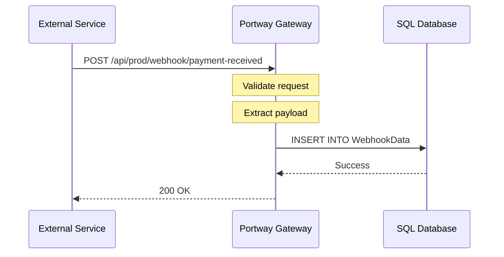

# Webhook Endpoints

Webhook endpoints in Portway provide a simple way to receive and store external event notifications in your SQL Server database. These endpoints act as HTTP receivers that automatically persist incoming webhook payloads, making them ideal for integrating with third-party services that use webhooks for notifications.

## Overview

Webhook endpoints allow you to:
- Receive HTTP POST requests from external services
- Automatically store webhook payloads in SQL Server
- Handle multiple webhook configurations
- Track when webhooks were received
- Process any valid JSON payload structure

You could, for example, use a program that loads the unprocessed data asynchronously and then processes it into your main database or triggers other workflows.

## How Webhooks Work



## Configuration

### Basic Webhook Configuration

Create a JSON file in the `endpoints/Webhooks/entity.json` directory:

```json
{
  "DatabaseObjectName": "WebhookData",
  "DatabaseSchema": "dbo",
  "AllowedColumns": [
    "payment_webhook",
    "shipping_webhook",
    "inventory_webhook"
  ]
}
```

### Configuration Properties

| Property | Type | Required | Description |
|----------|------|----------|-------------|
| `DatabaseObjectName` | string | Yes | Table name for storing webhook data |
| `DatabaseSchema` | string | No | Database schema (defaults to "dbo") |
| `AllowedColumns` | array | No | List of allowed webhook identifiers |

## Database Setup

### Create Webhook Table

The webhook system requires a specific table structure:

```sql
CREATE TABLE [dbo].[WebhookData] (
    [Id] INT IDENTITY(1,1) PRIMARY KEY,
    [WebhookId] NVARCHAR(255) NOT NULL,
    [Payload] NVARCHAR(MAX) NOT NULL,
    [ReceivedAt] DATETIME NOT NULL DEFAULT GETDATE()
);

-- Optional: Add index for faster queries
CREATE INDEX IX_WebhookData_WebhookId 
ON [dbo].[WebhookData] ([WebhookId], [ReceivedAt] DESC);
```

### Table Structure

| Column | Type | Description |
|--------|------|-------------|
| `Id` | INT | Auto-incrementing primary key |
| `WebhookId` | NVARCHAR(255) | Webhook identifier from the URL |
| `Payload` | NVARCHAR(MAX) | JSON payload from the request |
| `ReceivedAt` | DATETIME | Timestamp when the webhook was received |

## Using Webhook Endpoints

### Webhook URL Format

```
POST /api/{environment}/webhook/{webhookId}
```

- `{environment}`: Target environment (e.g., "prod", "test")
- `{webhookId}`: Identifier for the webhook type (e.g., "payment-received")

### Making Webhook Requests

```http
POST /api/prod/webhook/payment-received
Content-Type: application/json
Authorization: Bearer <token>

{
  "event": "payment.success",
  "payment_id": "pay_123456",
  "amount": 99.99,
  "currency": "EUR",
  "customer": {
    "id": "cust_789",
    "email": "customer@example.com"
  },
  "timestamp": "2024-03-15T10:30:00Z"
}
```

### Response Format

```json
{
  "message": "Webhook processed successfully",
  "id": 12345
}
```

## Webhook Identifier Validation

### Allowed Webhook IDs

Only webhook IDs listed in the `AllowedColumns` configuration are accepted:

```json
{
  "AllowedColumns": [
    "payment_webhook",     // ✓ Valid
    "shipping_webhook",    // ✓ Valid
    "unknown_webhook"      // ✗ Will be rejected
  ]
}
```

### Error Response

When using an unallowed webhook ID:

```json
{
  "error": "Webhook ID 'unknown_webhook' is not configured",
  "success": false
}
```

## Common Webhook Patterns

### Payment Provider Webhooks

Configure for payment notifications:

```json
{
  "DatabaseObjectName": "PaymentWebhooks",
  "AllowedColumns": [
    "stripe_events",
    "paypal_ipn",
    "square_notifications"
  ]
}
```

Example Stripe webhook:
```http
POST /api/prod/webhook/stripe_events
Content-Type: application/json

{
  "id": "evt_123456789",
  "object": "event",
  "type": "charge.succeeded",
  "data": {
    "object": {
      "id": "ch_123456789",
      "amount": 2000,
      "currency": "eur"
    }
  }
}
```

### E-commerce Platform Webhooks

Configure for order and inventory updates:

```json
{
  "DatabaseObjectName": "EcommerceWebhooks",
  "AllowedColumns": [
    "shopify_orders",
    "woocommerce_products",
    "magento_inventory"
  ]
}
```

### Monitoring Service Webhooks

Configure for system alerts:

```json
{
  "DatabaseObjectName": "MonitoringWebhooks",
  "AllowedColumns": [
    "datadog_alerts",
    "pingdom_notifications",
    "pagerduty_incidents"
  ]
}
```

## Processing Stored Webhooks

### Query Recent Webhooks

```sql
-- Get recent webhooks for a specific ID
SELECT TOP 10 
    Id,
    WebhookId,
    Payload,
    ReceivedAt
FROM WebhookData
WHERE WebhookId = 'payment_webhook'
ORDER BY ReceivedAt DESC;
```

### Parse JSON Payload

```sql
-- Extract specific values from JSON payload
SELECT 
    Id,
    WebhookId,
    JSON_VALUE(Payload, '$.event') as EventType,
    JSON_VALUE(Payload, '$.payment_id') as PaymentId,
    JSON_VALUE(Payload, '$.amount') as Amount,
    ReceivedAt
FROM WebhookData
WHERE WebhookId = 'payment_webhook'
  AND ReceivedAt > DATEADD(day, -1, GETDATE());
```

### Create Processing Procedures

```sql
CREATE PROCEDURE ProcessPaymentWebhooks
AS
BEGIN
    -- Process unprocessed webhooks
    DECLARE @WebhookId INT, @Payload NVARCHAR(MAX);
    
    DECLARE webhook_cursor CURSOR FOR
    SELECT Id, Payload
    FROM WebhookData
    WHERE WebhookId = 'payment_webhook'
      AND ProcessedAt IS NULL;
    
    OPEN webhook_cursor;
    FETCH NEXT FROM webhook_cursor INTO @WebhookId, @Payload;
    
    WHILE @@FETCH_STATUS = 0
    BEGIN
        -- Process webhook payload
        BEGIN TRY
            -- Your processing logic here
            
            -- Mark as processed
            UPDATE WebhookData
            SET ProcessedAt = GETDATE()
            WHERE Id = @WebhookId;
        END TRY
        BEGIN CATCH
            -- Log error
            INSERT INTO WebhookErrors (WebhookId, ErrorMessage)
            VALUES (@WebhookId, ERROR_MESSAGE());
        END CATCH
        
        FETCH NEXT FROM webhook_cursor INTO @WebhookId, @Payload;
    END
    
    CLOSE webhook_cursor;
    DEALLOCATE webhook_cursor;
END
```

## Security Considerations

### Authentication

All webhook endpoints require Bearer token authentication:

```http
Authorization: Bearer <your-token>
```

:::warning
External services must support custom headers to authenticate with Portway webhook endpoints. If the service doesn't support authentication headers, consider using a proxy service or implementing IP-based restrictions.
:::

### Network Security

1. **IP Whitelisting**: Configure your firewall to only allow webhook requests from known service IPs
2. **HTTPS Only**: Always use HTTPS in production to encrypt webhook payloads
3. **Rate Limiting**: Portway's built-in rate limiting protects against webhook flooding

### Data Validation

The webhook system automatically:
- Validates JSON syntax
- Checks webhook ID against allowed list
- Enforces size limits on payloads
- Sanitizes data before storage

## Best Practices

### 1. Use Descriptive Webhook IDs

Choose webhook IDs that clearly indicate their purpose:

```json
{
  "AllowedColumns": [
    "stripe_payment_success",     // ✓ Good
    "github_push_events",         // ✓ Good
    "webhook1",                   // ✗ Avoid
    "temp_hook"                   // ✗ Avoid
  ]
}
```

### 2. Implement Processing Logic

Don't just store webhooks—process them:

1. Create scheduled jobs to process webhook data
2. Implement error handling for failed processing
3. Add monitoring for webhook processing delays
4. Archive old webhook data periodically

### 3. Design for Reliability

Handle webhook delivery issues:

```sql
-- Add columns for processing status
ALTER TABLE WebhookData ADD 
    ProcessedAt DATETIME NULL,
    RetryCount INT DEFAULT 0,
    LastError NVARCHAR(MAX) NULL;
```

### 4. Monitor Webhook Activity

Set up monitoring queries:

```sql
-- Monitor webhook volume
SELECT 
    WebhookId,
    CAST(ReceivedAt as DATE) as Date,
    COUNT(*) as WebhookCount
FROM WebhookData
WHERE ReceivedAt > DATEADD(day, -7, GETDATE())
GROUP BY WebhookId, CAST(ReceivedAt as DATE)
ORDER BY Date DESC, WebhookId;
```

## Troubleshooting

### Common Issues

1. **"Webhook ID not configured" error**
   - Check that the webhook ID matches an entry in `AllowedColumns`
   - Ensure exact case matching (webhook IDs are case-sensitive)
   - Verify the configuration file is properly loaded

2. **Database connection errors**
   - Verify the table exists with correct schema
   - Check database permissions
   - Ensure connection string is valid

3. **Authentication failures**
   - Verify Bearer token is included in request
   - Check token has not expired
   - Ensure token has access to the environment

4. **Payload too large**
   - Check payload size limits (default 10MB)
   - Consider compressing large payloads
   - Store large data externally and reference it

### Debugging Webhooks

1. **Enable detailed logging**:
   ```json
   {
     "Logging": {
       "LogLevel": {
         "PortwayApi.Api.EndpointController": "Debug"
       }
     }
   }
   ```

2. **Test with simple payloads**:
   ```bash
   curl -X POST https://your-api/api/prod/webhook/test_webhook \
     -H "Authorization: Bearer <token>" \
     -H "Content-Type: application/json" \
     -d '{"test": "data"}'
   ```

3. **Check database directly**:
   ```sql
   SELECT TOP 10 * FROM WebhookData
   ORDER BY ReceivedAt DESC;
   ```

## Webhook vs Other Endpoints

| Feature | Webhook Endpoints | SQL Endpoints | Proxy Endpoints |
|---------|------------------|---------------|-----------------|
| Purpose | Receive external events | Database CRUD operations | Forward requests |
| HTTP Methods | POST only | GET, POST, PUT, DELETE | Configurable |
| Data Storage | Automatic | Query-based | None |
| Request Format | Any JSON | Structured queries | Pass-through |
| Response Format | Simple success | Query results | Service response |
| Use Case | External integrations | Data operations | Service proxy |

## Limitations

1. **POST Only**: Webhook endpoints only support POST requests
2. **JSON Only**: Payloads must be valid JSON
3. **No Processing**: Webhooks are stored as-is without processing
4. **No Validation**: Payload structure is not validated beyond JSON syntax
5. **No Retry**: Failed webhooks are not automatically retried

## Next Steps

- Configure [SQL Endpoints](/guide/endpoints/sql) for querying webhook data
- Set up [Security](/guide/security) for webhook authentication
- Implement [Monitoring](/guide/operations/monitoring) for webhook processing
- Create [Composite Endpoints](/guide/endpoints/composite) to process webhooks with business logic