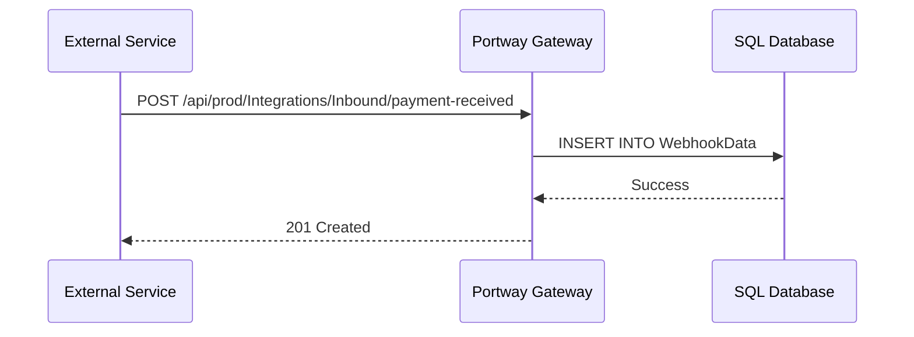

# Webhook Endpoints

Webhook endpoints accept POST requests from external services and store the JSON payload in a configured table. The webhook id is checked against `AllowedColumns`, the payload is inserted unchanged with a UTC timestamp, and the response returns the new row id.

::: warning Coming from the flat webhook route
The shared `endpoints/Webhooks/entity.json` and the route `POST /api/{env}/webhook/{id}` are removed; that route returns `410 Gone` with the new route format. Each webhook is defined in `endpoints/Webhooks/{Namespace}/{Name}/entity.json` and called at `POST /api/{env}/{namespace}/{name}/{id}`.
:::


```mermaid
sequenceDiagram
    participant External as External Service
    participant Portway as Portway Gateway
    participant DB as SQL Database

    External->>Portway: POST /api/prod/Integrations/Inbound/payment-received
    Portway->>DB: INSERT INTO WebhookData
    DB-->>Portway: Success
    Portway-->>External: 201 Created
```

A separate job or procedure processes the table. Portway does not retry failed inserts or forward payloads.

## Database setup

SQL Server table:

```sql
CREATE TABLE [dbo].[WebhookData] (
    [Id]         INT IDENTITY(1,1) PRIMARY KEY,
    [WebhookId]  NVARCHAR(255)    NOT NULL,
    [Payload]    NVARCHAR(MAX)    NOT NULL,
    [ReceivedAt] DATETIME         NOT NULL DEFAULT GETDATE()
);

CREATE INDEX IX_WebhookData_WebhookId
ON [dbo].[WebhookData] ([WebhookId], [ReceivedAt] DESC);
```

Equivalent tables for the other providers. PostgreSQL column names are quoted because they are case-sensitive:

::: code-group
```sql [PostgreSQL]
CREATE TABLE public."WebhookData" (
    "Id"         SERIAL PRIMARY KEY,
    "WebhookId"  VARCHAR(255) NOT NULL,
    "Payload"    TEXT         NOT NULL,
    "ReceivedAt" TIMESTAMPTZ  NOT NULL DEFAULT now()
);
```

```sql [MySQL / MariaDB]
CREATE TABLE WebhookData (
    Id         INT AUTO_INCREMENT PRIMARY KEY,
    WebhookId  VARCHAR(255) NOT NULL,
    Payload    LONGTEXT     NOT NULL,
    ReceivedAt DATETIME     NOT NULL
);
```

```sql [SQLite]
CREATE TABLE WebhookData (
    Id         INTEGER PRIMARY KEY AUTOINCREMENT,
    WebhookId  TEXT NOT NULL,
    Payload    TEXT NOT NULL,
    ReceivedAt TEXT NOT NULL
);
```
:::

The `ReceivedAt` value is stored in UTC.

Optional status columns for the processing job:

```sql
ALTER TABLE WebhookData ADD
    ProcessedAt DATETIME     NULL,
    RetryCount  INT          NOT NULL DEFAULT 0,
    LastError   NVARCHAR(MAX) NULL;
```

## Configuration

Example `endpoints/Webhooks/Integrations/Inbound/entity.json`, with namespace `Integrations` and endpoint name `Inbound`:

```json
{
  "DatabaseObjectName": "WebhookData",
  "DatabaseSchema": "dbo",
  "AllowedColumns": [
    "payment_webhook",
    "shipping_webhook",
    "inventory_webhook"
  ]
}
```

### Configuration properties

| Property | Required | Type | Description |
|---|---|---|---|
| `DatabaseObjectName` | Yes | string | Table for webhook payloads |
| `DatabaseSchema` | No | string | Database schema (default `dbo`) |
| `AllowedColumns` | No | array | Accepted webhook ids; other ids return `404` |

The webhook id is stored in the `WebhookId` column. Ids that name the source and event (e.g. `stripe_payment_success`, `shopify_order_created`) keep the table queryable.

## Sending webhooks

```
POST /api/{environment}/{namespace}/{name}/{webhookId}
```

```http
POST /api/prod/Integrations/Inbound/payment-received
Content-Type: application/json
Authorization: Bearer <token>

{
  "event": "payment.success",
  "payment_id": "pay_123456",
  "amount": 99.99,
  "currency": "EUR",
  "timestamp": "2024-03-15T10:30:00Z"
}
```

Response (`201 Created`):

```json
{
  "success": true,
  "message": "Webhook processed successfully",
  "result": null,
  "id": 12345
}
```

:::warning
Webhook endpoints require Bearer token authentication. Services that cannot send custom headers need a proxy or ingress layer that adds the token.
:::

## Querying stored payloads

Field extraction with SQL Server JSON functions:

```sql
-- Recent payloads for one webhook type
SELECT TOP 10
    Id,
    JSON_VALUE(Payload, '$.event')      AS EventType,
    JSON_VALUE(Payload, '$.payment_id') AS PaymentId,
    ReceivedAt
FROM WebhookData
WHERE WebhookId = 'payment_webhook'
ORDER BY ReceivedAt DESC;
```

## Limitations

- POST only
- JSON payloads only; other bodies are rejected
- No validation beyond JSON syntax and the webhook id
- No retry on insert failure
- Payload size limit: 10MB (default)
- `Tenancy` is not supported

## Troubleshooting

| Symptom | Resolution |
|---|---|
| "Webhook ID not configured" | Add the id to `AllowedColumns` (case-insensitive match). |
| Database errors | Check the table definition and the connection account's INSERT permission. |
| `401` or `403` | Check the token and its access to the environment. |

Debug logging:

```json
{
  "Serilog": {
    "MinimumLevel": {
      "Default": "Debug"
    }
  }
}
```

Minimal test request:

```bash
curl -X POST https://your-api/api/prod/Integrations/Inbound/test_webhook \
  -H "Authorization: Bearer <token>" \
  -H "Content-Type: application/json" \
  -d '{"test": "data"}'
```

## Next steps

- [SQL Endpoints](/guide/endpoints-sql)
- [Security](/guide/security)
- [Monitoring](/guide/monitoring)
