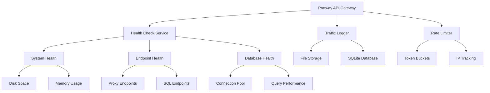

# Monitoring

Learn how to monitor your Portway API gateway for optimal performance, health, and reliability.

## Overview

Portway provides comprehensive monitoring capabilities through:
- Health check endpoints for liveness and readiness probes
- Detailed request/response logging
- Traffic monitoring and analytics
- Performance metrics and diagnostics
- Rate limiting visibility

## Health Checks

### Basic Health Check

Portway exposes several health check endpoints for different monitoring scenarios:

```http
GET /health
```

Returns a cached health report valid for 15 seconds:

```json
{
  "status": "Healthy",
  "timestamp": "2025-05-03T10:30:00Z",
  "cache_expires_in": "15 seconds"
}
```

### Liveness Probe

For Kubernetes or load balancer liveness checks:

```http
GET /health/live
```

Returns a simple response with 5-second cache:
```
Alive
```

### Detailed Health Check

For comprehensive system status:

```http
GET /health/details
Authorization: Bearer <token>
```

Returns detailed information about all health components:

```json
{
  "status": "Healthy",
  "timestamp": "2025-05-03T10:30:00Z",
  "cache_expires_in": "60 seconds",
  "checks": [
    {
      "name": "Diskspace",
      "status": "Healthy",
      "description": "Disk space: 65% remaining",
      "duration": "2.45ms",
      "data": {
        "PercentFree": "65%"
      },
      "tags": ["storage", "system"]
    },
    {
      "name": "ProxyEndpoints",
      "status": "Healthy",
      "description": "All proxy services are responding",
      "duration": "145.32ms",
      "tags": ["proxies", "external", "readiness"]
    }
  ],
  "totalDuration": "147.77ms",
  "version": "1.0.0"
}
```

::: tip
The detailed health check requires authentication and provides comprehensive diagnostics suitable for monitoring dashboards.
:::

## Request Traffic Logging

### Enabling Traffic Logging

Configure traffic logging in `appsettings.json`:

```json
{
  "RequestTrafficLogging": {
    "Enabled": true,
    "QueueCapacity": 10000,
    "StorageType": "file",
    "LogDirectory": "log/traffic",
    "MaxFileSizeMB": 50,
    "MaxFileCount": 5,
    "FilePrefix": "proxy_traffic_",
    "BatchSize": 100,
    "FlushIntervalMs": 1000,
    "IncludeRequestBodies": false,
    "IncludeResponseBodies": false,
    "MaxBodyCaptureSizeBytes": 4096,
    "CaptureHeaders": true,
    "EnableInfoLogging": true
  }
}
```

### Storage Options

Portway supports two storage types for traffic logs:

| Storage Type | Configuration | Best For |
|-------------|---------------|----------|
| File | `"StorageType": "file"` | Development, small deployments |
| SQLite | `"StorageType": "sqlite"` | Production, analytics queries |

#### File Storage Example

Traffic logs are stored as JSON files with structured data:

```json
{
  "Id": 1001,
  "Timestamp": "2025-05-03T10:30:00Z",
  "Method": "GET",
  "Path": "/api/prod/Products",
  "QueryString": "?$top=10",
  "Environment": "prod",
  "EndpointName": "Products",
  "TargetUrl": "http://internal-service/api/products?$top=10",
  "StatusCode": 200,
  "RequestSize": 0,
  "ResponseSize": 2048,
  "DurationMs": 125,
  "Username": "api-user",
  "ClientIp": "192.168.1.100",
  "TraceId": "a1b2c3d4",
  "RequestHeaders": {
    "Accept": "application/json",
    "Authorization": "[REDACTED]"
  }
}
```

#### SQLite Storage Configuration

For SQLite storage:

```json
{
  "RequestTrafficLogging": {
    "StorageType": "sqlite",
    "SqlitePath": "log/traffic_logs.db"
  }
}
```

::: warning
Be cautious when enabling `IncludeRequestBodies` or `IncludeResponseBodies` as they may capture sensitive data. Always sanitize or exclude sensitive information.
:::

## Log Management

### Log Rotation

Portway automatically manages log files with configurable rotation:

```json
{
  "Logging": {
    "LogLevel": {
      "Default": "Information",
      "Microsoft.AspNetCore": "Warning"
    }
  }
}
```

Log files are rotated daily with the following naming pattern:
- `portwayapi-20250503.log`
- `proxy_traffic_20250503_143000.json`

### Log Levels

Configure log levels for different components:

| Component | Recommended Level | Purpose |
|-----------|------------------|---------|
| Default | Information | General application logs |
| Microsoft.AspNetCore | Warning | Framework logs |
| Microsoft.EntityFrameworkCore | Warning | Database operations |
| System | Warning | System-level events |

## Performance Monitoring

### Connection Pooling Metrics

Monitor SQL connection pool performance:

```json
{
  "SqlConnectionPooling": {
    "MinPoolSize": 5,
    "MaxPoolSize": 100,
    "ConnectionTimeout": 15,
    "CommandTimeout": 30,
    "Enabled": true
  }
}
```

The connection pool service logs statistics every 10 minutes:
```
📊 SQL Connection Pool Status: Active connections: 12, Available: 88
```

### Rate Limiting Metrics

Monitor rate limiting activity:

```json
{
  "RateLimiting": {
    "Enabled": true,
    "IpLimit": 100,
    "IpWindow": 60,
    "TokenLimit": 100,
    "TokenWindow": 60
  }
}
```

Rate limiting events are logged with detailed information:
```
🚫 IP 192.168.1.100 has exceeded rate limit, blocking for 60s
🚫 Token rate limit exceeded for user_123 - Attempt 3
```

## Monitoring Architecture



## Alerting and Notifications

### Setting Up Alerts

Integrate Portway with monitoring systems:

1. **Health Check Alerts**
   ```bash
   # Example: Prometheus configuration
   - job_name: 'portway'
     metrics_path: '/health/details'
     scrape_interval: 30s
     scheme: 'https'
     bearer_token: 'your-token'
   ```

2. **Log-based Alerts**
   ```json
   {
     "Alerts": {
       "ErrorThreshold": 10,
       "AlertWindow": "5m",
       "NotificationChannels": ["email", "slack"]
     }
   }
   ```

3. **Performance Alerts**
   - Response time > 500ms
   - Error rate > 5%
   - Connection pool exhaustion
   - Disk space < 10%

## Traffic Analysis

### Query Traffic Logs with SQLite

When using SQLite storage, you can run analytics queries:

```sql
-- Top endpoints by request count
SELECT EndpointName, COUNT(*) as RequestCount
FROM TrafficLogs
WHERE Timestamp > datetime('now', '-1 hour')
GROUP BY EndpointName
ORDER BY RequestCount DESC
LIMIT 10;

-- Average response time by endpoint
SELECT EndpointName, AVG(DurationMs) as AvgDuration
FROM TrafficLogs
WHERE Timestamp > datetime('now', '-1 hour')
GROUP BY EndpointName
ORDER BY AvgDuration DESC;

-- Error rate by environment
SELECT Environment,
       COUNT(*) as TotalRequests,
       SUM(CASE WHEN StatusCode >= 400 THEN 1 ELSE 0 END) as Errors,
       CAST(SUM(CASE WHEN StatusCode >= 400 THEN 1 ELSE 0 END) AS FLOAT) / COUNT(*) * 100 as ErrorRate
FROM TrafficLogs
WHERE Timestamp > datetime('now', '-24 hours')
GROUP BY Environment;
```

### Traffic Patterns

Identify usage patterns and anomalies:

```sql
-- Requests per hour
SELECT strftime('%Y-%m-%d %H:00', Timestamp) as Hour,
       COUNT(*) as Requests
FROM TrafficLogs
WHERE Timestamp > datetime('now', '-24 hours')
GROUP BY Hour
ORDER BY Hour;

-- Slow queries
SELECT Path, QueryString, DurationMs, StatusCode
FROM TrafficLogs
WHERE DurationMs > 1000
  AND Timestamp > datetime('now', '-1 hour')
ORDER BY DurationMs DESC
LIMIT 20;
```

## Troubleshooting

### Common Monitoring Issues

1. **Health Check Failures**
   - Check disk space availability
   - Verify endpoint connectivity
   - Review proxy service status
   - Examine error logs

2. **Missing Traffic Logs**
   - Verify logging is enabled
   - Check write permissions on log directory
   - Ensure sufficient disk space
   - Review queue capacity settings

3. **Performance Issues**
   - Monitor connection pool usage
   - Check rate limiting configuration
   - Review slow query logs
   - Analyze endpoint response times

### Diagnostic Commands

```powershell
# Check disk space
Get-PSDrive -PSProvider FileSystem

# Monitor log file growth
Get-ChildItem -Path ".\log" -Recurse | 
    Sort-Object LastWriteTime -Descending | 
    Select-Object Name, Length, LastWriteTime -First 10

# Analyze error patterns
Select-String -Path ".\log\*.log" -Pattern "ERROR" | 
    Group-Object -Property Filename | 
    Select-Object Count, Name
```

## Best Practices

::: tip Performance Monitoring
1. Set up automated health checks every 30 seconds
2. Configure alerts for critical metrics
3. Regularly review traffic patterns
4. Archive old logs to maintain performance
5. Use SQLite storage for production analytics
:::

::: warning Security Considerations
- Always redact sensitive headers in logs
- Use separate tokens for monitoring endpoints
- Limit access to detailed health information
- Regularly rotate log files
- Consider data retention policies
:::

## Integration Examples

It's straightforward to add Portway to your monitoring applications, like Prometheus and Grafana:

### Prometheus Integration

```yaml
global:
  scrape_interval: 15s
  evaluation_interval: 15s

scrape_configs:
  - job_name: 'portway'
    metrics_path: '/health/details'
    bearer_token: 'your-monitoring-token'
    static_configs:
      - targets: ['portway.yourdomain.com']
```

### Grafana Dashboard

```json
{
  "dashboard": {
    "title": "Portway API Gateway",
    "panels": [
      {
        "title": "Request Rate",
        "type": "graph",
        "datasource": "Prometheus",
        "targets": [
          {
            "expr": "rate(portway_requests_total[5m])"
          }
        ]
      },
      {
        "title": "Error Rate",
        "type": "singlestat",
        "datasource": "Prometheus",
        "targets": [
          {
            "expr": "rate(portway_errors_total[5m])"
          }
        ]
      }
    ]
  }
}
```

## Next Steps

- [Security Guide](../security)
- [API Endpoints Guide](../api-endpoints)
- [Deployment Guide](../deployment)
- [Troubleshooting Guide](../troubleshooting)