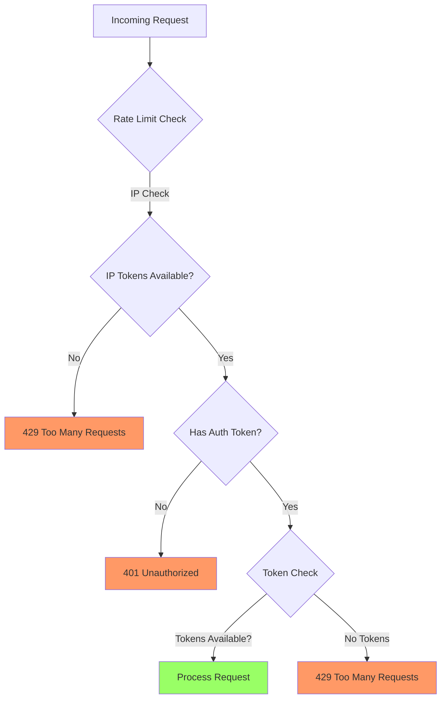

# Rate Limiting

Rate limiting in Portway helps protect your API gateway and backend services from abuse, prevents resource exhaustion, and ensures fair usage across all clients. This guide covers how to configure and manage rate limiting features.

:::tip  Note
Rate limiting is enabled by default.
:::

## Overview

Portway implements rate limiting using token bucket algorithms with separate limits for:
- IP-based requests (for all traffic)
- Token-based requests (per authentication token)

The system tracks requests in memory and applies sliding window rate limits with automatic recovery.

## Configuration

### Basic Setup

Rate limiting is configured in `appsettings.json`:

```json
{
  "RateLimiting": {
    "Enabled": true,
    "IpLimit": 100,
    "IpWindow": 60,
    "TokenLimit": 1000,
    "TokenWindow": 60
  }
}
```

### Configuration Options

| Setting | Description | Default |
|---------|-------------|---------|
| `Enabled` | Enables/disables rate limiting globally | `true` |
| `IpLimit` | Maximum requests per IP address | `100` |
| `IpWindow` | Time window for IP limits (seconds) | `60` |
| `TokenLimit` | Maximum requests per token | `1000` |
| `TokenWindow` | Time window for token limits (seconds) | `60` |

## How It Works

Portway uses a token bucket algorithm for rate limiting:



### Rate Limiting Process

1. **IP-based limiting** - Applied to all requests
2. **Authentication check** - Verifies valid token
3. **Token-based limiting** - Applied to authenticated requests
4. **Request processing** - If all checks pass

### Token Bucket Algorithm

Each client (IP or token) gets a "bucket" of tokens:
- Bucket starts full with the configured limit
- Each request consumes one token
- Tokens refill at a constant rate
- When empty, requests are blocked until tokens refill

## Response Codes and Headers

### Rate Limit Exceeded Response

When rate limits are exceeded, Portway returns:

```http
HTTP/1.1 429 Too Many Requests
Content-Type: application/json
Retry-After: 45

{
  "error": "Too many requests",
  "retryAfter": "2024-03-07T12:34:56Z",
  "success": false
}
```

### Headers

Rate limit responses include:
- `Retry-After` - Seconds until the client can retry
- Standard headers for content type and caching

## Monitoring Rate Limits

### Checking Current Limits

Rate limit information is logged when limits are exceeded:

```log
🚫 Rate limit reached for token_abc123: 0.25/100 tokens available, 1 required
```

### Common Log Messages

| Message | Description |
|---------|-------------|
| `🚫 IP {IP} has exceeded rate limit` | IP-based limit reached |
| `🚫 Token rate limit exceeded for {Token}` | Token-based limit reached |
| `🛑 Persistent rate limit violations detected` | Multiple violations from same client |

## Advanced Configuration

### Custom Rate Limits per Endpoint

While Portway uses global rate limits, you can implement custom limits by:

1. Creating separate tokens for different API tiers
2. Adjusting limits based on token scopes
3. Using multiple Portway instances with different configurations

### Handling Burst Traffic

For APIs that experience burst traffic:

```json
{
  "RateLimiting": {
    "Enabled": true,
    "IpLimit": 200,      // Higher limit
    "IpWindow": 30,      // Shorter window
    "TokenLimit": 2000,
    "TokenWindow": 30
  }
}
```

:::tip Burst Configuration
Shorter windows with higher limits allow for traffic bursts while maintaining overall protection.
:::

## Best Practices

### 1. Set Appropriate Limits

Consider your backend capacity when setting limits:

```json
{
  "RateLimiting": {
    "IpLimit": 60,        // 1 request per second per IP
    "IpWindow": 60,
    "TokenLimit": 600,    // 10 requests per second per token
    "TokenWindow": 60
  }
}
```

### 2. Monitor and Adjust

Regularly review logs to identify:
- Legitimate users hitting limits
- Potential abuse patterns
- Need for limit adjustments

### 3. Implement Client-Side Retry Logic

Encourage API clients to handle rate limits gracefully. Here are examples in multiple languages:

::: code-group

```javascript [JavaScript/Node.js]
async function makeRequest(url, options) {
  const response = await fetch(url, options);
  
  if (response.status === 429) {
    const retryAfter = parseInt(response.headers.get('Retry-After'));
    console.log(`Rate limited. Retrying after ${retryAfter} seconds...`);
    await new Promise(resolve => setTimeout(resolve, retryAfter * 1000));
    return makeRequest(url, options); // Retry
  }
  
  return response;
}

// Usage
try {
  const response = await makeRequest('https://api.example.com/data', {
    headers: { 'Authorization': 'Bearer your-token' }
  });
  const data = await response.json();
  console.log(data);
} catch (error) {
  console.error('Request failed:', error);
}
```

```python [Python]
import requests
import time
from typing import Dict, Any

def make_request(url: str, headers: Dict[str, str] = None) -> requests.Response:
    """Makes a request with automatic retry on rate limiting."""
    response = requests.get(url, headers=headers)
    
    if response.status_code == 429:
        retry_after = int(response.headers.get('Retry-After', 60))
        print(f"Rate limited. Retrying after {retry_after} seconds...")
        time.sleep(retry_after)
        return make_request(url, headers)  # Retry
    
    response.raise_for_status()
    return response

# Usage
try:
    response = make_request(
        'https://api.example.com/data',
        headers={'Authorization': 'Bearer your-token'}
    )
    data = response.json()
    print(data)
except requests.RequestException as e:
    print(f"Request failed: {e}")
```

```csharp [C#/.NET]
using System;
using System.Net.Http;
using System.Threading.Tasks;

public class ApiClient
{
    private readonly HttpClient _httpClient;

    public ApiClient()
    {
        _httpClient = new HttpClient();
    }

    public async Task<HttpResponseMessage> MakeRequestAsync(string url)
    {
        var response = await _httpClient.GetAsync(url);
        
        if ((int)response.StatusCode == 429)
        {
            if (response.Headers.TryGetValues("Retry-After", out var values))
            {
                var retryAfter = int.Parse(values.First());
                Console.WriteLine($"Rate limited. Retrying after {retryAfter} seconds...");
                await Task.Delay(retryAfter * 1000);
                return await MakeRequestAsync(url); // Retry
            }
        }
        
        response.EnsureSuccessStatusCode();
        return response;
    }
}

// Usage
var client = new ApiClient();
try
{
    var response = await client.MakeRequestAsync("https://api.example.com/data");
    var content = await response.Content.ReadAsStringAsync();
    Console.WriteLine(content);
}
catch (HttpRequestException ex)
{
    Console.WriteLine($"Request failed: {ex.Message}");
}
```

```java [Java]
import java.io.IOException;
import java.net.URI;
import java.net.http.HttpClient;
import java.net.http.HttpRequest;
import java.net.http.HttpResponse;
import java.time.Duration;

public class ApiClient {
    private final HttpClient httpClient;
    
    public ApiClient() {
        this.httpClient = HttpClient.newBuilder()
                .connectTimeout(Duration.ofSeconds(10))
                .build();
    }
    
    public HttpResponse<String> makeRequest(String url) throws IOException, InterruptedException {
        HttpRequest request = HttpRequest.newBuilder()
                .uri(URI.create(url))
                .header("Authorization", "Bearer your-token")
                .build();
        
        HttpResponse<String> response = httpClient.send(request, 
                HttpResponse.BodyHandlers.ofString());
        
        if (response.statusCode() == 429) {
            String retryAfterHeader = response.headers()
                    .firstValue("Retry-After")
                    .orElse("60");
            int retryAfter = Integer.parseInt(retryAfterHeader);
            
            System.out.printf("Rate limited. Retrying after %d seconds...%n", retryAfter);
            Thread.sleep(retryAfter * 1000L);
            return makeRequest(url); // Retry
        }
        
        if (response.statusCode() >= 400) {
            throw new IOException("Request failed with status: " + response.statusCode());
        }
        
        return response;
    }
    
    // Usage
    public static void main(String[] args) {
        ApiClient client = new ApiClient();
        try {
            HttpResponse<String> response = client.makeRequest("https://api.example.com/data");
            System.out.println(response.body());
        } catch (IOException | InterruptedException e) {
            System.err.println("Request failed: " + e.getMessage());
        }
    }
}
```

```php [PHP]
<?php

function makeRequest($url, $headers = []) {
    $ch = curl_init($url);
    curl_setopt($ch, CURLOPT_RETURNTRANSFER, true);
    curl_setopt($ch, CURLOPT_HTTPHEADER, $headers);
    curl_setopt($ch, CURLOPT_HEADER, true);
    
    $response = curl_exec($ch);
    $httpCode = curl_getinfo($ch, CURLINFO_HTTP_CODE);
    $headerSize = curl_getinfo($ch, CURLINFO_HEADER_SIZE);
    
    if ($httpCode === 429) {
        $headers = substr($response, 0, $headerSize);
        
        // Parse Retry-After header
        preg_match('/Retry-After: (\d+)/i', $headers, $matches);
        $retryAfter = isset($matches[1]) ? (int)$matches[1] : 60;
        
        echo "Rate limited. Retrying after {$retryAfter} seconds...\n";
        sleep($retryAfter);
        
        curl_close($ch);
        return makeRequest($url, $headers); // Retry
    }
    
    curl_close($ch);
    
    if ($httpCode >= 400) {
        throw new Exception("Request failed with status: {$httpCode}");
    }
    
    return substr($response, $headerSize);
}

// Usage
try {
    $response = makeRequest(
        'https://api.example.com/data',
        ['Authorization: Bearer your-token']
    );
    $data = json_decode($response, true);
    print_r($data);
} catch (Exception $e) {
    echo "Request failed: " . $e->getMessage() . "\n";
}
?>
```

```go [Go]
package main

import (
    "fmt"
    "io"
    "net/http"
    "strconv"
    "time"
)

func makeRequest(url string, token string) ([]byte, error) {
    client := &http.Client{}
    req, err := http.NewRequest("GET", url, nil)
    if err != nil {
        return nil, err
    }
    
    req.Header.Add("Authorization", "Bearer "+token)
    
    resp, err := client.Do(req)
    if err != nil {
        return nil, err
    }
    defer resp.Body.Close()
    
    if resp.StatusCode == 429 {
        retryAfter := resp.Header.Get("Retry-After")
        seconds, err := strconv.Atoi(retryAfter)
        if err != nil {
            seconds = 60 // Default to 60 seconds
        }
        
        fmt.Printf("Rate limited. Retrying after %d seconds...\n", seconds)
        time.Sleep(time.Duration(seconds) * time.Second)
        return makeRequest(url, token) // Retry
    }
    
    if resp.StatusCode >= 400 {
        return nil, fmt.Errorf("request failed with status: %d", resp.StatusCode)
    }
    
    return io.ReadAll(resp.Body)
}

// Usage
func main() {
    data, err := makeRequest("https://api.example.com/data", "your-token")
    if err != nil {
        fmt.Printf("Request failed: %v\n", err)
        return
    }
    
    fmt.Println(string(data))
}
```

:::

### Advanced Retry Strategies

For production applications, consider implementing more sophisticated retry strategies:

1. **Exponential Backoff**: Increase wait time exponentially with each retry
2. **Jitter**: Add random variation to prevent thundering herd problems
3. **Circuit Breaker**: Stop retrying after multiple failures
4. **Max Retries**: Limit the number of retry attempts

Example with exponential backoff and jitter:

::: code-group

```javascript [JavaScript/Node.js]
async function makeRequestWithBackoff(url, options, maxRetries = 3) {
  let retries = 0;
  
  while (retries < maxRetries) {
    try {
      const response = await fetch(url, options);
      
      if (response.status === 429) {
        retries++;
        const retryAfter = parseInt(response.headers.get('Retry-After') || '60');
        
        // Exponential backoff with jitter
        const backoffTime = Math.min(
          retryAfter * Math.pow(2, retries - 1) * 1000,
          60000 // Max 1 minute
        );
        const jitter = Math.random() * 1000; // Random 0-1 second
        
        console.log(`Retry ${retries}/${maxRetries} after ${backoffTime + jitter}ms`);
        await new Promise(resolve => setTimeout(resolve, backoffTime + jitter));
        continue;
      }
      
      return response;
    } catch (error) {
      if (retries === maxRetries - 1) throw error;
      retries++;
    }
  }
  
  throw new Error(`Failed after ${maxRetries} retries`);
}
```

```python [Python]
import requests
import time
import random
from typing import Optional, Dict

def make_request_with_backoff(url: str, headers: Dict[str, str] = None, 
                             max_retries: int = 3) -> requests.Response:
    """Makes a request with exponential backoff and jitter."""
    retries = 0
    
    while retries < max_retries:
        try:
            response = requests.get(url, headers=headers)
            
            if response.status_code == 429:
                retries += 1
                retry_after = int(response.headers.get('Retry-After', 60))
                
                # Exponential backoff with jitter
                backoff_time = min(
                    retry_after * (2 ** (retries - 1)),
                    60  # Max 1 minute
                )
                jitter = random.uniform(0, 1)  # Random 0-1 second
                total_wait = backoff_time + jitter
                
                print(f"Retry {retries}/{max_retries} after {total_wait:.2f} seconds")
                time.sleep(total_wait)
                continue
            
            response.raise_for_status()
            return response
            
        except requests.RequestException as e:
            if retries == max_retries - 1:
                raise
            retries += 1
    
    raise Exception(f"Failed after {max_retries} retries")
```

```csharp [C#/.NET]
using System;
using System.Net.Http;
using System.Threading.Tasks;

public class ApiClientWithBackoff
{
    private readonly HttpClient _httpClient;
    private readonly Random _random = new Random();

    public ApiClientWithBackoff()
    {
        _httpClient = new HttpClient();
    }

    public async Task<HttpResponseMessage> MakeRequestWithBackoffAsync(
        string url, 
        int maxRetries = 3)
    {
        int retries = 0;
        
        while (retries < maxRetries)
        {
            try
            {
                var response = await _httpClient.GetAsync(url);
                
                if ((int)response.StatusCode == 429)
                {
                    retries++;
                    int retryAfter = 60; // Default
                    
                    if (response.Headers.TryGetValues("Retry-After", out var values))
                    {
                        retryAfter = int.Parse(values.First());
                    }
                    
                    // Exponential backoff with jitter
                    double backoffTime = Math.Min(
                        retryAfter * Math.Pow(2, retries - 1),
                        60  // Max 1 minute
                    );
                    double jitter = _random.NextDouble(); // Random 0-1 second
                    int totalWaitMs = (int)((backoffTime + jitter) * 1000);
                    
                    Console.WriteLine($"Retry {retries}/{maxRetries} after {totalWaitMs}ms");
                    await Task.Delay(totalWaitMs);
                    continue;
                }
                
                response.EnsureSuccessStatusCode();
                return response;
            }
            catch (HttpRequestException)
            {
                if (retries == maxRetries - 1) throw;
                retries++;
            }
        }
        
        throw new Exception($"Failed after {maxRetries} retries");
    }
}
```

```java [Java]
import java.io.IOException;
import java.net.URI;
import java.net.http.HttpClient;
import java.net.http.HttpRequest;
import java.net.http.HttpResponse;
import java.time.Duration;
import java.util.Random;

public class ApiClientWithBackoff {
    private final HttpClient httpClient;
    private final Random random;
    
    public ApiClientWithBackoff() {
        this.httpClient = HttpClient.newBuilder()
                .connectTimeout(Duration.ofSeconds(10))
                .build();
        this.random = new Random();
    }
    
    public HttpResponse<String> makeRequestWithBackoff(String url, int maxRetries) 
            throws IOException, InterruptedException {
        int retries = 0;
        
        while (retries < maxRetries) {
            try {
                HttpRequest request = HttpRequest.newBuilder()
                        .uri(URI.create(url))
                        .header("Authorization", "Bearer your-token")
                        .build();
                
                HttpResponse<String> response = httpClient.send(request, 
                        HttpResponse.BodyHandlers.ofString());
                
                if (response.statusCode() == 429) {
                    retries++;
                    String retryAfterHeader = response.headers()
                            .firstValue("Retry-After")
                            .orElse("60");
                    int retryAfter = Integer.parseInt(retryAfterHeader);
                    
                    // Exponential backoff with jitter
                    double backoffTime = Math.min(
                            retryAfter * Math.pow(2, retries - 1),
                            60  // Max 1 minute
                    );
                    double jitter = random.nextDouble(); // Random 0-1 second
                    long totalWaitMs = (long) ((backoffTime + jitter) * 1000);
                    
                    System.out.printf("Retry %d/%d after %dms%n", 
                            retries, maxRetries, totalWaitMs);
                    Thread.sleep(totalWaitMs);
                    continue;
                }
                
                if (response.statusCode() >= 400) {
                    throw new IOException("Request failed with status: " 
                            + response.statusCode());
                }
                
                return response;
            } catch (IOException | InterruptedException e) {
                if (retries == maxRetries - 1) throw e;
                retries++;
            }
        }
        
        throw new IOException("Failed after " + maxRetries + " retries");
    }
}
```

```php [PHP]
<?php

function makeRequestWithBackoff($url, $headers = [], $maxRetries = 3) {
    $retries = 0;
    
    while ($retries < $maxRetries) {
        try {
            $ch = curl_init($url);
            curl_setopt($ch, CURLOPT_RETURNTRANSFER, true);
            curl_setopt($ch, CURLOPT_HTTPHEADER, $headers);
            curl_setopt($ch, CURLOPT_HEADER, true);
            
            $response = curl_exec($ch);
            
            if ($response === false) {
                throw new Exception(curl_error($ch));
            }
            
            $httpCode = curl_getinfo($ch, CURLINFO_HTTP_CODE);
            $headerSize = curl_getinfo($ch, CURLINFO_HEADER_SIZE);
            
            if ($httpCode === 429) {
                $retries++;
                $headers = substr($response, 0, $headerSize);
                
                // Parse Retry-After header
                preg_match('/Retry-After: (\d+)/i', $headers, $matches);
                $retryAfter = isset($matches[1]) ? (int)$matches[1] : 60;
                
                // Exponential backoff with jitter
                $backoffTime = min(
                    $retryAfter * pow(2, $retries - 1),
                    60  // Max 1 minute
                );
                $jitter = mt_rand(0, 1000) / 1000; // Random 0-1 second
                $totalWait = $backoffTime + $jitter;
                
                echo "Retry {$retries}/{$maxRetries} after {$totalWait} seconds\n";
                usleep($totalWait * 1000000); // Convert to microseconds
                
                curl_close($ch);
                continue;
            }
            
            curl_close($ch);
            
            if ($httpCode >= 400) {
                throw new Exception("Request failed with status: {$httpCode}");
            }
            
            return substr($response, $headerSize);
            
        } catch (Exception $e) {
            if ($retries === $maxRetries - 1) throw $e;
            $retries++;
        }
    }
    
    throw new Exception("Failed after {$maxRetries} retries");
}
```

```go [Go]
package main

import (
    "fmt"
    "io"
    "math"
    "math/rand"
    "net/http"
    "strconv"
    "time"
)

func makeRequestWithBackoff(url string, token string, maxRetries int) ([]byte, error) {
    client := &http.Client{}
    retries := 0
    rand.Seed(time.Now().UnixNano())
    
    for retries < maxRetries {
        req, err := http.NewRequest("GET", url, nil)
        if err != nil {
            return nil, err
        }
        
        req.Header.Add("Authorization", "Bearer "+token)
        
        resp, err := client.Do(req)
        if err != nil {
            if retries == maxRetries-1 {
                return nil, err
            }
            retries++
            continue
        }
        defer resp.Body.Close()
        
        if resp.StatusCode == 429 {
            retries++
            retryAfter := resp.Header.Get("Retry-After")
            seconds, err := strconv.Atoi(retryAfter)
            if err != nil {
                seconds = 60 // Default to 60 seconds
            }
            
            // Exponential backoff with jitter
            backoffTime := math.Min(
                float64(seconds)*math.Pow(2, float64(retries-1)),
                60, // Max 1 minute
            )
            jitter := rand.Float64() // Random 0-1 second
            totalWait := time.Duration((backoffTime+jitter)*1000) * time.Millisecond
            
            fmt.Printf("Retry %d/%d after %v\n", retries, maxRetries, totalWait)
            time.Sleep(totalWait)
            continue
        }
        
        if resp.StatusCode >= 400 {
            return nil, fmt.Errorf("request failed with status: %d", resp.StatusCode)
        }
        
        return io.ReadAll(resp.Body)
    }
    
    return nil, fmt.Errorf("failed after %d retries", maxRetries)
}
```

:::

## Troubleshooting

### Common Issues

#### 1. Legitimate Users Getting Blocked

**Symptoms**: Valid API users receiving 429 errors

**Solutions**:
- Increase limits for authenticated tokens
- Review client request patterns
- Consider implementing tiered access

#### 2. Rate Limits Not Working

**Symptoms**: No rate limiting applied to requests

**Solutions**:
- Verify `"Enabled": true` in configuration
- Check middleware ordering in `Program.cs`
- Restart application after configuration changes

#### 3. Inconsistent Rate Limiting

**Symptoms**: Limits seem to reset unexpectedly

**Solutions**:
- Ensure consistent server time
- Check for multiple Portway instances
- Verify window configuration

### Debugging Rate Limits

Enable detailed logging to troubleshoot issues:

```json
{
  "Serilog": {
    "MinimumLevel": {
      "Override": {
        "PortwayApi.Middleware.RateLimiter": "Debug"
      }
    }
  }
}
```

## Security Considerations

### Preventing Bypass Attempts

Rate limiting helps prevent:
- Brute force attacks
- Denial of service attempts
- Resource exhaustion
- API abuse

:::warning Security Note
Rate limiting alone is not sufficient security. Always use it in combination with:
- Strong authentication
- Input validation
- Proper error handling
- Security headers
:::

### Distributed Environments

For load-balanced deployments:
- Rate limits are per-instance
- Consider using distributed caching for shared limits
- Use sticky sessions where appropriate

## Next Steps

- Learn about [Security Headers](/guide/security-headers) for additional protection
- Configure [Request Logging](/guide/logging) to monitor rate limit effectiveness
- Implement [Token Management](/guide/token-management) for fine-grained access control
- Set up [Monitoring and Alerts](/guide/monitoring) for rate limit events
