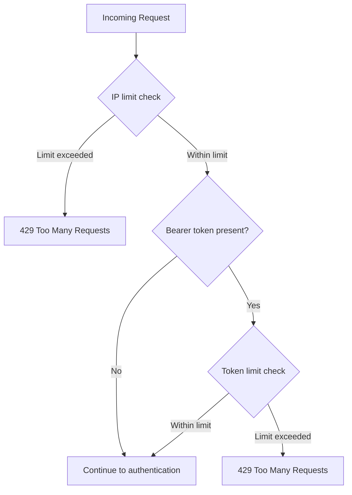

# Rate Limiting

Rate limiting protects your backends from both accidents and abuse, and it is enabled by default. Portway applies two independent limits in sequence: an IP-based check on all traffic, then a token-based check on requests that carry a Bearer token. Both use a token bucket algorithm with continuous refill. Each client gets a bucket that refills at a constant rate and depletes by one per request, so short bursts are absorbed gracefully as long as the average rate stays within the limit.


```mermaid
graph TD
    A[Incoming Request] --> B{IP limit check}
    B -->|Limit exceeded| C[429 Too Many Requests]
    B -->|Within limit| D{Bearer token present?}
    D -->|No| G[Continue to authentication]
    D -->|Yes| E{Token limit check}
    E -->|Limit exceeded| F[429 Too Many Requests]
    E -->|Within limit| G
```

Rate limiting runs before token authentication, which means an invalid token still consumes from its own bucket. This ordering is intentional: it keeps a flood of bad credentials from reaching the more expensive verification step.

## Configuration

```json
{
  "RateLimiting": {
    "Enabled": true,
    "IpLimit": 100,
    "IpWindow": 60,
    "TokenLimit": 1000,
    "TokenWindow": 60,
    "Store": "Memory"
  }
}
```

| Field | Description | Default |
|---|---|---|
| `Enabled` | Enable or disable rate limiting globally | `true` |
| `IpLimit` | Maximum requests per IP per window | `100` |
| `IpWindow` | Window duration in seconds for IP limits | `60` |
| `TokenLimit` | Maximum requests per token per window | `1000` |
| `TokenWindow` | Window duration in seconds for token limits | `60` |
| `Store` | Bucket storage backend, `Memory` or `Redis` | `Memory` |
| `RedisConnectionString` | Connection string for the Redis store | none |

With the default `Memory` store, rate state lives in process memory. In a load-balanced deployment with multiple Portway instances this means limits are enforced per instance, not across the cluster. If that suits your setup, there is nothing more to configure.

## Per-token limits

The global `TokenLimit` works well when all your API consumers behave similarly. When they do not, you can give any token its own limit instead of raising the global one for everyone. A partner integration that syncs in bursts might get `5000` requests per `60` seconds, while a third-party token you trust less can be held to `10` per minute.

You can set a per-token limit from the Access Tokens page in the web UI, either when creating a token or later through the edit drawer. Leaving the field blank keeps the token on the global limit, and clearing it later reverts the token to the global limit again. Changes take effect within about 30 seconds without a restart, and every change is recorded in the token's audit log.

The same fields are available on the token API if you prefer to script it:

```json
{
  "username": "partner-sync",
  "rate_limit_requests": 5000,
  "rate_limit_window_seconds": 60
}
```

## Distributed deployments with Redis

When you run several Portway instances behind a load balancer and want one shared budget across all of them, the Redis store is available as an opt-in:

```json
{
  "RateLimiting": {
    "Store": "Redis",
    "RedisConnectionString": "localhost:6379"
  }
}
```

If you already use Redis for [caching](/reference/caching), you can leave `RedisConnectionString` empty and Portway will reuse the caching connection string. Bucket state is evaluated atomically on the Redis server, so all instances draw from the same buckets.

Should Redis become unreachable, Portway falls back to the in-memory store and keeps serving traffic with per-instance limits. Rate limiting is designed to never take the gateway down.

## Rate limit response

When a limit is exceeded, Portway returns:

```http
HTTP/1.1 429 Too Many Requests
Retry-After: 45
X-RateLimit-Limit: 100
X-RateLimit-Remaining: 0
X-RateLimit-Reset: 1616161616
X-RateLimit-Resource: token

{
  "error": "Too many requests",
  "retrytime": "2024-03-07T12:34:56Z",
  "success": false
}
```

The `Retry-After` header contains the number of seconds before requests are accepted again, and `retrytime` in the body carries the same moment as an ISO timestamp. Successful responses include the `X-RateLimit-*` headers too, which makes it easy for well-behaved clients to pace themselves before ever hitting a limit. The full header set is described in the [headers reference](/reference/headers).

A client that keeps hammering after being limited is placed in a longer block. An IP that overflows its bucket is blocked for the full window. A token that repeatedly runs into its limit sees the block duration double with each consecutive violation after the third, up to a maximum of one hour. Backing off when you receive a `429` is therefore not just polite, it actively shortens your wait.

## Tuning for burst traffic

A shorter window with a higher limit accommodates traffic that arrives in bursts rather than at a steady rate:

```json
{
  "RateLimiting": {
    "IpLimit": 200,
    "IpWindow": 30,
    "TokenLimit": 2000,
    "TokenWindow": 30
  }
}
```

## Client retry logic

Clients should check for `429` responses and respect the `Retry-After` header before retrying:

```javascript
async function request(url, options) {
  const response = await fetch(url, options);

  if (response.status === 429) {
    const retryAfter = parseInt(response.headers.get('Retry-After') || '60');
    await new Promise(resolve => setTimeout(resolve, retryAfter * 1000));
    return request(url, options);
  }

  return response;
}
```

For production clients, combine this with exponential backoff, jitter, and a maximum retry count to avoid thundering-herd behaviour after a rate limit event.

## Observing the limiter

The dashboard in the web UI shows a Rate Limiting card with the active store, the configured limits, and any currently blocked IPs or tokens. The same data is available as JSON from `/ui/api/ratelimits` if you want to feed it into your own monitoring.

## Troubleshooting

**Legitimate users receiving 429**: Review whether the `IpLimit` is too low for expected traffic. If a single service account is being rate limited, consider giving its token a per-token limit rather than raising `TokenLimit` for everyone.

**Rate limiting not applying**: Confirm `"Enabled": true` in configuration and that the application has restarted after the change.

**Limits resetting unexpectedly**: With the `Memory` store, rate state is in process memory and any application restart resets all buckets. This is expected behaviour. The Redis store keeps bucket state across restarts.

Rate limit events are logged at Warning level:

```
Token rate limit exceeded for abcd...wxyz - Attempt 2
IP 192.168.1.100 has exceeded rate limit, blocking for 60s
```

To increase verbosity:

```json
{
  "Serilog": {
    "MinimumLevel": {
      "Override": {
        "PortwayApi.Middleware.RateLimiter": "Debug"
      }
    }
  }
}
```

## Next steps

- [Security](/guide/security)
- [Monitoring](/guide/monitoring)
