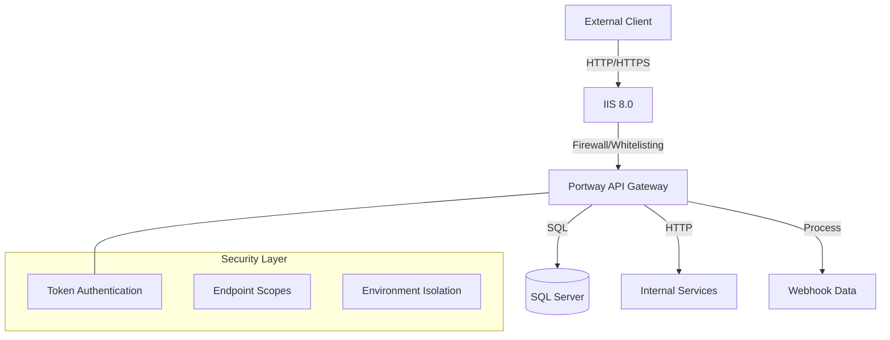
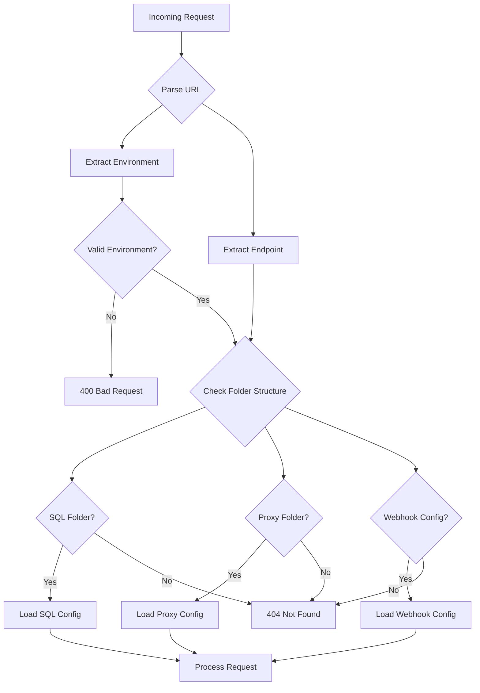

# Structure

Portway uses a folder-based routing system to organize and expose different types of endpoints. This guide explains how the deployment folder structure determines API routes and endpoint behavior.

## Architecture

The way Portway exposes data is rather simple. It functions as a bridge:



## Complete Folder Structure

When deploying Portway, the following folder structure is required:

```
PortwayApi/
├── log/                    # Application logs
├── tokens/                 # Authentication token storage
├── environments/           # Environment configurations
│   ├── settings.json       # Global environment settings
│   ├── dev/
│   │   └── settings.json   # Development environment config
│   ├── test/
│   │   └── settings.json   # Test environment config
│   └── prod/
│       └── settings.json   # Production environment config
├── endpoints/              # API endpoint definitions
│   ├── SQL/                # SQL-based endpoints
│   │   ├── Products/
│   │   │   ├── entity.json
│   ├── Proxy/              # Proxy & composite endpoints
│   │   ├── Accounts/
│   │   │   └── entity.json
│   │   └── SalesOrder/     # Composite example
│   │       └── entity.json 
│   ├── Webhooks/           # Webhook endpoints
│   │    └── entity.json
|   └── Files/              # File endpoints
│   │   ├── CustomerData/
│   │   │   └── entity.json
│   │   └── Images/
│   │       └── entity.json 
|   └── Static/              # Static endpoints
│   │   ├── Countries/
│   │   │   └── entity.json
├── appsettings.json        # Application configuration
├── auth.db                 # Authentication database (created automatically)
└── web.config              # IIS configuration
```

## Folder Purposes

### Core Folders

| Folder | Purpose | Created By |
|--------|---------|------------|
| `log/` | Stores application logs with daily rotation | Application |
| `tokens/` | Contains authentication token files | TokenGenerator |
| `environments/` | Environment-specific configurations | Manual setup |
| `endpoints/` | API endpoint definitions | Manual setup |

### Endpoint Folders

| Path | Description | Route Pattern |
|------|-------------|---------------|
| `endpoints/SQL/` | SQL database endpoints | `/api/{env}/{endpoint}` |
| `endpoints/Proxy/` | Internal service proxies | `/api/{env}/{endpoint}` |
| `endpoints/Webhooks/` | Incoming webhook handlers | `/api/{env}/webhook/{id}` |
| `endpoints/Files/` | File handling services | `/api/{env}/files/{endpoint}` |


## Setting Up the Structure

The required folders will be created during deployment.

## Route Formation

Routes are automatically generated based on the folder structure:

### SQL Endpoints

Folder structure:
```
endpoints/SQL/Products/
└── entity.json
```

Generated route: `/api/{env}/Products`

Supported methods: GET, POST, PUT, DELETE (based on configuration)

### Proxy Endpoints

Folder structure:
```
endpoints/Proxy/Accounts/
└── entity.json
```

Generated route: `/api/{env}/Accounts`

Supported methods: Defined in entity.json

### Composite Endpoints

Folder structure:
```
endpoints/Proxy/SalesOrder/
└── entity.json    # Type: "Composite"
```

Generated route: `/api/{env}/composite/SalesOrder`

Supported methods: POST only

### Webhook Endpoints

Folder structure:
```
endpoints/Webhooks/
└── entity.json
```

Generated route: `/api/{env}/webhook/{webhookId}`

Supported methods: POST only

## Route Resolution Process

When a request arrives, Portway resolves routes through this process:



## Folder Permissions

Ensure proper permissions for IIS deployment:

| Folder | Required Permissions | Purpose |
|--------|---------------------|----------|
| `log/` | Read/Write | Log file creation and rotation |
| `tokens/` | Read/Write | Token file management |
| `environments/` | Read | Configuration access |
| `endpoints/` | Read | Endpoint definition access |
| Root folder | Read/Write | Database and temporary files |

:::warning Security Note
Never expose the deployment folder structure through web access. The `web.config` file should prevent directory browsing.
:::

## Next Steps

- Configure [Environments](/guide/environments) for your deployment
- Set up [SQL Endpoints](/guide/endpoints-sql) for database access
- Create [Proxy Endpoints](/guide/endpoints-proxy) for service integration
- Implement [Webhooks](/guide/webhooks) for external integrations