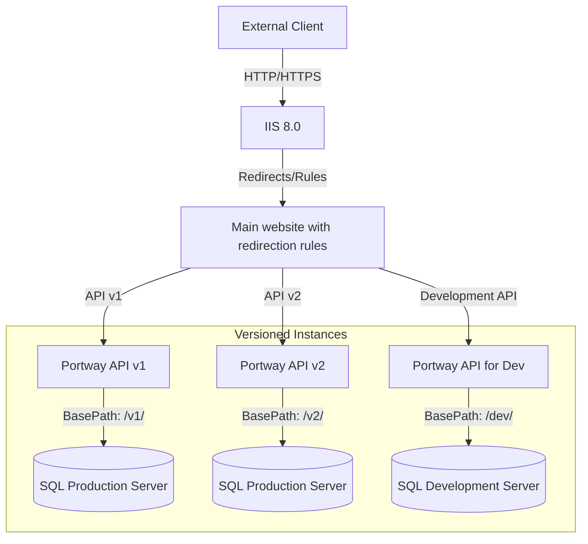

# Versioning

Versioning in Portway allows you to manage multiple versions of your API gateway, enabling transitions between versions and ensuring backward compatibility. This guide explains how to set up versioning using IIS (Internet Information Services) and environment variables.

## Overview

Versioning relies on having multiple Portway installations in separate version-specific folders (e.g., `v1`, `v2`). Requests are routed to the appropriate version folder based on the configuration in IIS or environment variables.

### Key Concepts
- **Version Folders**: Each version of Portway resides in its own folder (e.g., `v1`, `v2`).
- **Default Version**: Requests to the root URL are redirected to the default version (e.g., `v1`).
- **Environment Variables**: You can use environment variables to dynamically configure the default version.

### Key Concepts Visualization

To better understand the key concepts of versioning in Portway, refer to the simplified diagram below:



## Setting Up Versioning in IIS

To enable versioning in IIS, follow these steps:

### 1. Add Version Folders

1. Create separate folders for each version of Portway (e.g., `v1`, `v2`). E.g. `C:\path\to\your\PortwayApi\v1` and `C:\path\to\your\PortwayApi\v2`
2. Add the folder to IIS and convert it to an application:
   - Open IIS Manager.
   - Right-click the folder (e.g., `v1`) and select **Convert to Application**.

### 2. Add Configuration Files

In the root folder of your IIS site, add the following files (e.g. `C:\path\to\your\PortwayApi`).

#### `web.config`

```xml
<?xml version="1.0" encoding="utf-8"?>
<configuration>
  <system.webServer>
	<rewrite>
	  <rules>

		<!-- Allow all versioned paths (v1, v2, dev) to pass through unchanged -->
		<rule name="Allow versioned paths" stopProcessing="true">
		  <match url="^(v1|v2|dev)(/.*)?$" />
		  <action type="None" />
		</rule>

		<!-- Redirect root (/) to the default version -->
		<rule name="Redirect root to default version" stopProcessing="true">
		  <match url="^$" />
		  <action type="Redirect" url="v1/" redirectType="Permanent" />
		</rule>

		<!-- Redirect index.html to the default version -->
		<rule name="Redirect index.html to default version" stopProcessing="true">
		  <match url="^index\.html$" />
		  <action type="Redirect" url="v1/" redirectType="Permanent" />
		</rule>

		<!-- Redirect any non-versioned request to the default version -->
		<rule name="Redirect non-versioned requests to default version" stopProcessing="true">
		  <match url="^(?!v1/|v2/|dev/).*" />
		  <action type="Redirect" url="v1/" redirectType="Permanent" />
		</rule>

	  </rules>
	</rewrite>


    <!-- Serve index.html as the default document -->
    <defaultDocument>
      <files>
        <clear />
        <add value="index.html" />
      </files>
    </defaultDocument>
	
    <httpProtocol>
      <customHeaders>
        <remove name="X-Powered-By" />
        <remove name="X-Content-Type-Options" />
        <remove name="X-Frame-Options" />
        <remove name="Strict-Transport-Security" />
        <remove name="Referrer-Policy" />
        <remove name="Permissions-Policy" />
        <remove name="Content-Security-Policy" />

        <add name="X-Content-Type-Options" value="nosniff" />
        <add name="X-Frame-Options" value="DENY" />
        <add name="Strict-Transport-Security" value="max-age=31536000; includeSubDomains; preload" />
        <add name="Referrer-Policy" value="strict-origin-when-cross-origin" />
        <add name="Permissions-Policy" value="geolocation=(), camera=(), microphone=(), payment=()" />
        <add name="Content-Security-Policy" 
             value="default-src 'self'; script-src 'self' https://cdn.jsdelivr.net 'unsafe-inline'; style-src 'self' 'unsafe-inline'; img-src 'self' data:; connect-src 'self' https://proxy.scalar.com; font-src 'self' https://fonts.scalar.com; object-src 'none'; base-uri 'self'; form-action 'none'; frame-ancestors 'none'" />
      </customHeaders>
    </httpProtocol>

  </system.webServer>
</configuration>
```

#### `index.html`

```html
<!DOCTYPE html>
<html lang="en">
<head>
    <meta charset="UTF-8">
    <meta name="viewport" content="width=device-width, initial-scale=1.0">
    <meta http-equiv="refresh" content="0;url=v1/">
    <title>Redirecting...</title>
</head>
<body>
</body>
</html>
```

> [!TIP]
> This is just a configuration example, make sure to change the redirection rules based on your needs and requirements. 

### 3. Update `appsettings.json`

In each version folder, update the `PathBase` property in the `appsettings.json` file to match the version folder name. For example, for version `v1`, set:

```json
"PathBase": "v1"
```

> [!WARNING]
> Make sure to set-up different instance names for the various data sources that you may be working with (Redis, SQL Server), to make sure you can differentiate traffic from the (now) multiple versions.

This ensures that the application correctly identifies the base path for each version.


### 4. Create Seperate Application Pools

The same application pool can't be used twice for the same application. To circumvent this limitation, make sure to create seperate application pools for each version (e.g. `PortwayApi_v1` and `PortwayApi_v2`) and bind them to each site.

### 5. Test the Setup

1. Open a browser and navigate to the root URL of your site.
2. Verify that requests are redirected to the default version (e.g., `/v1/`).
3. Test other versions by navigating to their specific paths (e.g., `/v2/`).

## Best Practices

1. **Use Clear Versioning**: Name version folders clearly (e.g., `v1`, `v2`).
2. **Test Thoroughly**: Ensure all redirects and configurations work as expected.
3. **Monitor Logs**: Check IIS logs for any issues with versioning.
4. **Document Changes**: Keep a record of version-specific changes for future reference.

By following this guide, you can effectively manage multiple versions of your Portway API gateway, ensuring a smooth experience for your users and developers.
