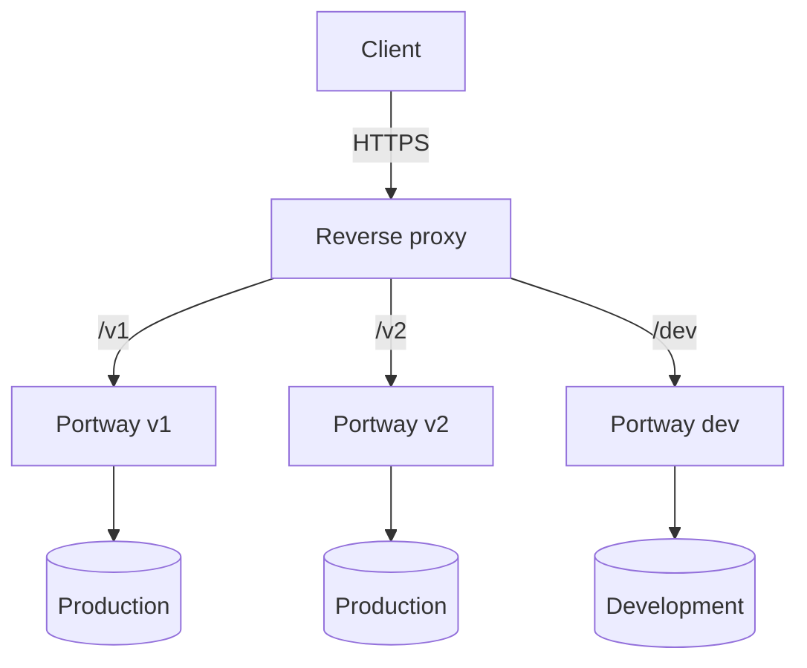

# Versioning

Multiple Portway versions run side by side as separate instances, each under its own path (e.g. `/v1`, `/v2`, `/dev`). A reverse proxy routes each path to its instance and redirects the root URL to the default version. Versions of one endpoint within an instance: [Namespaces](/reference/namespaces#versions).


```mermaid
graph TD
    Client[Client] -->|HTTPS| Proxy[Reverse proxy]
    Proxy -->|/v1| V1[Portway v1]
    Proxy -->|/v2| V2[Portway v2]
    Proxy -->|/dev| Dev[Portway dev]
    V1 --> DB1[(Production)]
    V2 --> DB2[(Production)]
    Dev --> DBDev[(Development)]
```

Each instance has:

| Setting | Value |
|---|---|
| Working directory | Its own folder; `auth.db`, `endpoints/`, `environments/` and `tokens/` are per instance |
| `PathBase` (`PORTWAY_PATH_BASE`) | Its path, e.g. `/v1` |
| Port | Its own, e.g. `5001` (`ASPNETCORE_URLS=http://127.0.0.1:5001`) |
| `ForwardedHeaders:KnownProxies` | The reverse proxy address ([Application Settings](/reference/app-settings#forwardedheaders)) |

The proxy forwards the full path including the prefix; Portway removes it through `PathBase`. Shared data sources use a distinct name per instance (e.g. Redis `InstanceName`, SQL `ApplicationName`).

## Linux

Proxy configuration for `/v1` and `/v2`, with `/v1` as the default:

::: code-group

```nginx [Nginx]
server {
    listen 443 ssl;
    server_name api.example.com;

    ssl_certificate     /etc/ssl/api.example.com.crt;
    ssl_certificate_key /etc/ssl/api.example.com.key;

    location = / {
        return 301 /v1/;
    }

    location /v1/ {
        proxy_pass http://127.0.0.1:5001;
        proxy_set_header Host $host;
        proxy_set_header X-Forwarded-For $proxy_add_x_forwarded_for;
        proxy_set_header X-Forwarded-Proto $scheme;
    }

    location /v2/ {
        proxy_pass http://127.0.0.1:5002;
        proxy_set_header Host $host;
        proxy_set_header X-Forwarded-For $proxy_add_x_forwarded_for;
        proxy_set_header X-Forwarded-Proto $scheme;
    }
}
```

```caddy [Caddy]
api.example.com {
    redir / /v1/ permanent

    handle /v1/* {
        reverse_proxy 127.0.0.1:5001
    }

    handle /v2/* {
        reverse_proxy 127.0.0.1:5002
    }
}
```

:::

The forwarded request keeps the `/v1` prefix: Nginx `proxy_pass` has no trailing path, and Caddy uses `handle`, not `handle_path`. Caddy sets `X-Forwarded-For` and `X-Forwarded-Proto` and obtains the certificate itself.

With Docker, each container publishes its own host port (e.g. `127.0.0.1:5001:8080`) and sets `PORTWAY_PATH_BASE`. Requests from a host proxy originate from the Docker bridge. `ForwardedHeaders:KnownNetworks` lists the bridge range (e.g. `172.16.0.0/12`).

## Windows (IIS)

### 1. Version folders

1. Create a folder per version, e.g. `C:\path\to\your\PortwayApi\v1` and `C:\path\to\your\PortwayApi\v2`.
2. In IIS Manager, right-click each folder and select **Convert to Application**.

### 2. Site configuration

Files in the site root (e.g. `C:\path\to\your\PortwayApi`):

#### `web.config`

```xml
<?xml version="1.0" encoding="utf-8"?>
<configuration>
  <system.webServer>
    <rewrite>
      <rules>
        <rule name="Allow versioned paths" stopProcessing="true">
          <match url="^(v1|v2|dev)(/.*)?$" />
          <action type="None" />
        </rule>
        <rule name="Redirect to default version" stopProcessing="true">
          <match url=".*" />
          <action type="Redirect" url="v1/" redirectType="Permanent" />
        </rule>
      </rules>
    </rewrite>
    <httpProtocol>
      <customHeaders>
        <remove name="X-Powered-By" />
      </customHeaders>
    </httpProtocol>
  </system.webServer>
</configuration>
```

The first rule lists the version paths in use and passes them through. The second redirects every other path, the root included, to the default version. Portway sets the security headers (`Content-Security-Policy`, `Strict-Transport-Security`, `X-Frame-Options` and others). Headers added in `web.config` duplicate them.

### 3. Path base

Each version's `appsettings.json` sets `PathBase` to its folder name, e.g. for `v1`:

```json
"PathBase": "v1"
```

### 4. Application pools

Each version needs its own application pool (e.g. `PortwayApi_v1`, `PortwayApi_v2`).

## Related topics

- [Deployment](/guide/deployment)
- [Deploying with Docker](/guide/deployment-docker)
- [Deploying on Windows Server](/guide/deployment-windows)
- [Upgrading](/guide/upgrading)
