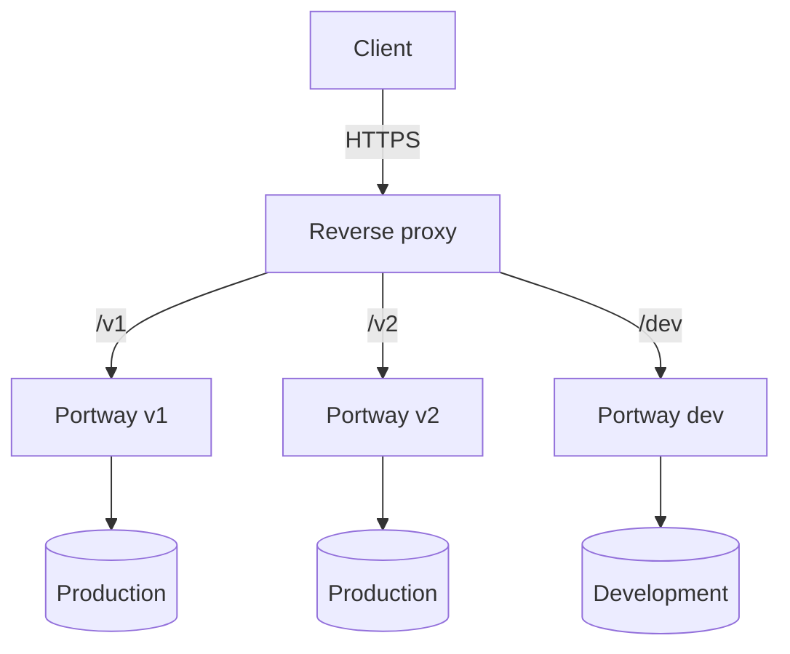

# Versioning

Multiple Portway versions run side by side as separate instances, each under its own path (e.g. `/v1`, `/v2`, `/dev`). A reverse proxy routes each path to its instance and redirects the root URL to the default version.


```mermaid
graph TD
    Client[Client] -->|HTTPS| Proxy[Reverse proxy]
    Proxy -->|/v1| V1[Portway v1]
    Proxy -->|/v2| V2[Portway v2]
    Proxy -->|/dev| Dev[Portway dev]
    V1 --> DB1[(Production)]
    V2 --> DB2[(Production)]
    Dev --> DBDev[(Development)]
```

Each instance has:

| Setting | Value |
|---|---|
| Working directory | Its own folder; `auth.db`, `endpoints/`, `environments/` and `tokens/` are per instance |
| `PathBase` (`PORTWAY_PATH_BASE`) | Its path, e.g. `/v1` |
| Port | Its own, e.g. `5001` (`ASPNETCORE_URLS=http://127.0.0.1:5001`) |
| `ForwardedHeaders:KnownProxies` | The reverse proxy address ([Application Settings](/reference/app-settings#forwardedheaders)) |

The proxy forwards the full path including the prefix; Portway removes it through `PathBase`. Shared data sources use a distinct name per instance (e.g. Redis `InstanceName`, SQL `ApplicationName`).

## Linux

Each instance runs as its own systemd service or container with the settings above. The proxy configuration for `/v1` and `/v2`, with `/v1` as the default:

::: code-group

```nginx [Nginx]
server {
    listen 443 ssl;
    server_name api.example.com;

    ssl_certificate     /etc/ssl/api.example.com.crt;
    ssl_certificate_key /etc/ssl/api.example.com.key;

    location = / {
        return 301 /v1/;
    }

    location /v1/ {
        proxy_pass http://127.0.0.1:5001;
        proxy_set_header Host $host;
        proxy_set_header X-Forwarded-For $proxy_add_x_forwarded_for;
        proxy_set_header X-Forwarded-Proto $scheme;
    }

    location /v2/ {
        proxy_pass http://127.0.0.1:5002;
        proxy_set_header Host $host;
        proxy_set_header X-Forwarded-For $proxy_add_x_forwarded_for;
        proxy_set_header X-Forwarded-Proto $scheme;
    }
}
```

```caddy [Caddy]
api.example.com {
    redir / /v1/ permanent

    handle /v1/* {
        reverse_proxy 127.0.0.1:5001
    }

    handle /v2/* {
        reverse_proxy 127.0.0.1:5002
    }
}
```

:::

The forwarded request keeps the `/v1` prefix: Nginx `proxy_pass` has no trailing path, and Caddy uses `handle`, not `handle_path`. Caddy sets `X-Forwarded-For` and `X-Forwarded-Proto` and obtains the certificate itself.

With Docker, each container publishes its own host port (e.g. `127.0.0.1:5001:8080`) and sets `PORTWAY_PATH_BASE`. Requests from a host proxy arrive from the Docker bridge, so `ForwardedHeaders:KnownNetworks` lists the bridge range (e.g. `172.16.0.0/12`).

## Windows (IIS)

### 1. Version folders

1. Create a folder per version, e.g. `C:\path\to\your\PortwayApi\v1` and `C:\path\to\your\PortwayApi\v2`.
2. In IIS Manager, right-click each folder and select **Convert to Application**.

### 2. Site configuration

Files in the site root (e.g. `C:\path\to\your\PortwayApi`):

#### `web.config`

```xml
<?xml version="1.0" encoding="utf-8"?>
<configuration>
  <system.webServer>
	<rewrite>
	  <rules>

		<!-- Allow all versioned paths (v1, v2, dev) to pass through unchanged -->
		<rule name="Allow versioned paths" stopProcessing="true">
		  <match url="^(v1|v2|dev)(/.*)?$" />
		  <action type="None" />
		</rule>

		<!-- Redirect root (/) to the default version -->
		<rule name="Redirect root to default version" stopProcessing="true">
		  <match url="^$" />
		  <action type="Redirect" url="v1/" redirectType="Permanent" />
		</rule>

		<!-- Redirect index.html to the default version -->
		<rule name="Redirect index.html to default version" stopProcessing="true">
		  <match url="^index\.html$" />
		  <action type="Redirect" url="v1/" redirectType="Permanent" />
		</rule>

		<!-- Redirect any non-versioned request to the default version -->
		<rule name="Redirect non-versioned requests to default version" stopProcessing="true">
		  <match url="^(?!v1/|v2/|dev/).*" />
		  <action type="Redirect" url="v1/" redirectType="Permanent" />
		</rule>

	  </rules>
	</rewrite>

    <!-- Serve index.html as the default document -->
    <defaultDocument>
      <files>
        <clear />
        <add value="index.html" />
      </files>
    </defaultDocument>
	
    <httpProtocol>
      <customHeaders>
        <remove name="X-Powered-By" />
        <remove name="X-Content-Type-Options" />
        <remove name="X-Frame-Options" />
        <remove name="Strict-Transport-Security" />
        <remove name="Referrer-Policy" />
        <remove name="Permissions-Policy" />

        <add name="X-Content-Type-Options" value="nosniff" />
        <add name="X-Frame-Options" value="DENY" />
        <add name="Strict-Transport-Security" value="max-age=31536000; includeSubDomains; preload" />
        <add name="Referrer-Policy" value="strict-origin-when-cross-origin" />
        <add name="Permissions-Policy" value="geolocation=(), camera=(), microphone=(), payment=()" />
      </customHeaders>
    </httpProtocol>

  </system.webServer>
</configuration>
```

Portway sets `Content-Security-Policy` itself, `/docs` included. `web.config` omits the header, so each response has a single policy.

#### `index.html`

```html
<!DOCTYPE html>
<html lang="en">
<head>
    <meta charset="UTF-8">
    <meta name="viewport" content="width=device-width, initial-scale=1.0">
    <meta http-equiv="refresh" content="0;url=v1/">
    <title>Redirecting...</title>
</head>
<body>
</body>
</html>
```

::: tip
Adjust the redirect rules to the versions in use.
:::

### 3. Path base

Each version's `appsettings.json` sets `PathBase` to its folder name, e.g. for `v1`:

```json
"PathBase": "v1"
```

### 4. Application pools

Each version needs its own application pool (e.g. `PortwayApi_v1`, `PortwayApi_v2`).

### 5. Verification

- The root URL redirects to the default version (e.g. `/v1/`).
- Each version path (e.g. `/v2/`) serves its instance.

## Related topics

- [Deployment](/guide/deployment)
- [Deploying with Docker](/guide/deployment-docker)
- [Deploying on Windows Server](/guide/deployment-windows)
- [Upgrading](/guide/upgrading)
