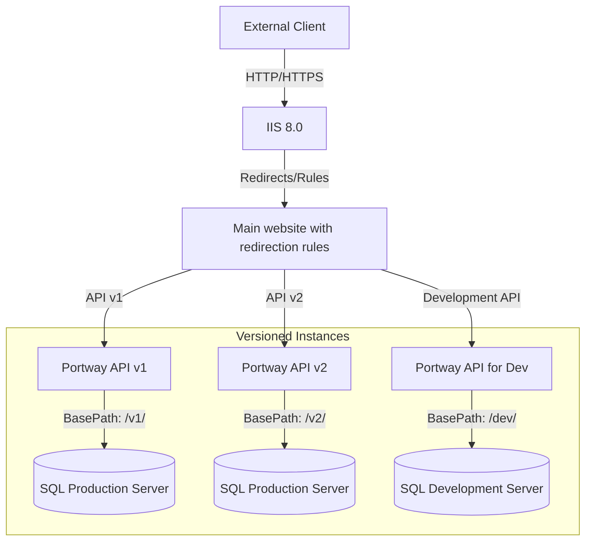

# Versioning

Multiple Portway versions can run side by side under IIS, each in its own folder and application, with a default version for the root URL.

## Overview


```mermaid
graph TD
    Client[External Client] -->|HTTP/HTTPS| IIS[IIS 8.0]
    IIS -->|Redirects/Rules| Versions[Main website with redirection rules]
    Versions -->|API v1| API_V1[Portway API v1]
    Versions -->|API v2| API_V2[Portway API v2]
    Versions -->|Development API| Dev_API[Portway API for Dev]

    subgraph Versioned Instances 
        API_V1 -->|BasePath: /v1/| DB1[(SQL Production Server)]
        API_V2 -->|BasePath: /v2/| DB2[(SQL Production Server)]
        Dev_API -->|BasePath: /dev/| DBDev[(SQL Development Server)]
    end
```

## Setting up versioning in IIS

### 1. Add version folders

1. Create a folder per version, e.g. `C:\path\to\your\PortwayApi\v1` and `C:\path\to\your\PortwayApi\v2`.
2. In IIS Manager, right-click each folder and select **Convert to Application**.

### 2. Add configuration files

Files in the site root (e.g. `C:\path\to\your\PortwayApi`):

#### `web.config`

```xml
<?xml version="1.0" encoding="utf-8"?>
<configuration>
  <system.webServer>
	<rewrite>
	  <rules>

		<!-- Allow all versioned paths (v1, v2, dev) to pass through unchanged -->
		<rule name="Allow versioned paths" stopProcessing="true">
		  <match url="^(v1|v2|dev)(/.*)?$" />
		  <action type="None" />
		</rule>

		<!-- Redirect root (/) to the default version -->
		<rule name="Redirect root to default version" stopProcessing="true">
		  <match url="^$" />
		  <action type="Redirect" url="v1/" redirectType="Permanent" />
		</rule>

		<!-- Redirect index.html to the default version -->
		<rule name="Redirect index.html to default version" stopProcessing="true">
		  <match url="^index\.html$" />
		  <action type="Redirect" url="v1/" redirectType="Permanent" />
		</rule>

		<!-- Redirect any non-versioned request to the default version -->
		<rule name="Redirect non-versioned requests to default version" stopProcessing="true">
		  <match url="^(?!v1/|v2/|dev/).*" />
		  <action type="Redirect" url="v1/" redirectType="Permanent" />
		</rule>

	  </rules>
	</rewrite>

    <!-- Serve index.html as the default document -->
    <defaultDocument>
      <files>
        <clear />
        <add value="index.html" />
      </files>
    </defaultDocument>
	
    <httpProtocol>
      <customHeaders>
        <remove name="X-Powered-By" />
        <remove name="X-Content-Type-Options" />
        <remove name="X-Frame-Options" />
        <remove name="Strict-Transport-Security" />
        <remove name="Referrer-Policy" />
        <remove name="Permissions-Policy" />

        <add name="X-Content-Type-Options" value="nosniff" />
        <add name="X-Frame-Options" value="DENY" />
        <add name="Strict-Transport-Security" value="max-age=31536000; includeSubDomains; preload" />
        <add name="Referrer-Policy" value="strict-origin-when-cross-origin" />
        <add name="Permissions-Policy" value="geolocation=(), camera=(), microphone=(), payment=()" />
      </customHeaders>
    </httpProtocol>

  </system.webServer>
</configuration>
```

The site-level `web.config` declares no `Content-Security-Policy`. Portway sets its own through `SecurityHeadersMiddleware`, `/docs` included.

#### `index.html`

```html
<!DOCTYPE html>
<html lang="en">
<head>
    <meta charset="UTF-8">
    <meta name="viewport" content="width=device-width, initial-scale=1.0">
    <meta http-equiv="refresh" content="0;url=v1/">
    <title>Redirecting...</title>
</head>
<body>
</body>
</html>
```

::: tip
Adjust the redirect rules to the versions in use.
:::

### 3. Update `appsettings.json`

Each version's `appsettings.json` sets `PathBase` to its folder name, e.g. for `v1`:

```json
"PathBase": "v1"
```

::: warning
Use distinct instance names per version for shared data sources (e.g. Redis `InstanceName`, SQL `ApplicationName`) to keep their traffic apart.
:::

### 4. Create separate Application Pools

Each version needs its own application pool (e.g. `PortwayApi_v1`, `PortwayApi_v2`).

### 5. Test the setup

- The root URL redirects to the default version (e.g. `/v1/`).
- Each version path (e.g. `/v2/`) serves its instance.
