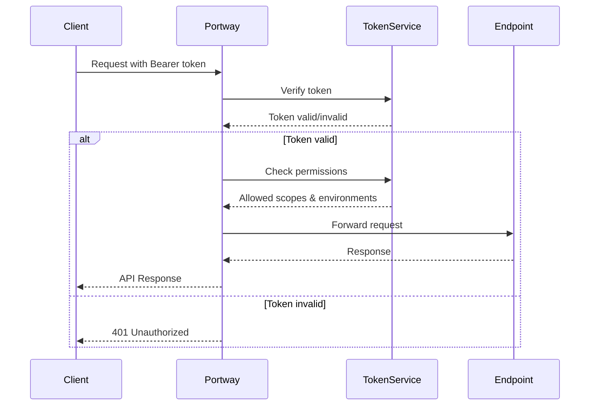

# Authentication

> Token properties, scope patterns, and the authentication flow for Portway API requests.

All API requests require a bearer token:

```http
Authorization: Bearer your_token_here
```

Requests without a valid token receive `401 Unauthorized`. The only unauthenticated endpoint is `/health/live`.

## Token Properties

| Property | Description | Default |
|----------|-------------|---------|
| `username` | Unique identifier for the token | Required |
| `tokenHash` | PBKDF2-SHA256 hash, 10,000 iterations, 256-bit output | Auto-generated |
| `tokenSalt` | 128-bit random salt | Auto-generated |
| `createdAt` | Creation timestamp | Current time |
| `expiresAt` | Expiration date | `null` (never expires) |
| `revokedAt` | Revocation timestamp | `null` (active) |
| `allowedScopes` | Endpoint access restrictions | `*` (all endpoints) |
| `allowedEnvironments` | Environment access restrictions | `*` (all environments) |
| `description` | Purpose note | Empty |

Tokens are created and managed in the [Web UI](/guide/webui) under **Tokens**.

## Scope Patterns

### Endpoint scopes (`allowedScopes`)

| Pattern | Access |
|---------|--------|
| `*` | All endpoints |
| `Products` | Single endpoint |
| `Products,Orders` | Named endpoints only (comma-separated) |
| `Product*` | All endpoints matching the prefix |
| `Company/Employees` | Specific namespaced endpoint |
| `Company/*` | All endpoints in a namespace |
| `GET:Products` | Single endpoint, single HTTP method |

### Environment scopes (`allowedEnvironments`)

| Pattern | Access |
|---------|--------|
| `*` | All environments |
| `prod` | Single environment |
| `dev,test` | Named environments (comma-separated) |
| `dev*` | All environments matching the prefix |

## Authentication Flow



## Validation Process

When a request arrives, Portway:

1. Extracts the token from the `Authorization: Bearer` header
2. Verifies the token against its stored hash
3. Checks token expiration
4. Checks the token has not been revoked
5. Validates endpoint scope against `allowedScopes`
6. Validates environment scope against `allowedEnvironments`

## Error Responses

| Status | Error | Cause |
|--------|-------|-------|
| 401 | `Authentication required` | Missing `Authorization` header |
| 401 | `Invalid or expired token` | Token invalid, expired, or revoked |
| 403 | `Access denied to endpoint` | Token lacks endpoint permission |
| 403 | `Access denied to environment` | Token lacks environment permission |

### Correct header format

```http
# Correct
Authorization: Bearer your_token_here

# Incorrect — missing "Bearer" prefix
Authorization: your_token_here
```

## Token Lifecycle

1. **Create** — generate a token with defined scopes and environment restrictions in the Web UI
2. **Distribute** — share the token value securely with the service or user
3. **Use** — include in `Authorization: Bearer` header on every request
4. **Rotate** — generate a replacement before the old token expires; the old token is invalidated
5. **Revoke** — immediately invalidate a compromised or unused token

Revocation is permanent. A revoked token cannot be reactivated.

## Related Topics

- [Web UI guide](/guide/webui) — create, revoke, rotate, and audit tokens
- [Security guide](/guide/security) — incident response for compromised tokens
- [HTTP Headers](/reference/headers) — full header reference
- [Token audit log](/reference/token-generator) — audit trail schema
