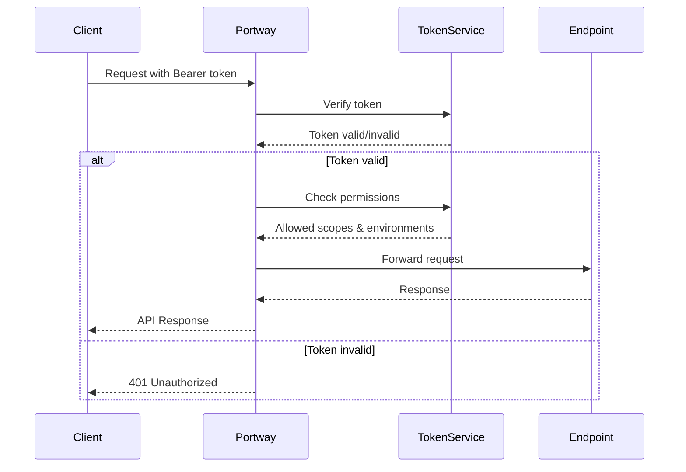

# Authentication

API requests authenticate with a Bearer token:

```http
Authorization: Bearer your_token_here
```

Requests without a valid token return `401`. Unauthenticated paths: `/health`, `/health/live` and the Prometheus scrape path.

## Token properties

| Property | Description | Default |
|---|---|---|
| `username` | Token name | Required |
| `tokenHash` | PBKDF2-SHA256 hash, 10,000 iterations, 256-bit output | Generated |
| `tokenSalt` | 128-bit random salt | Generated |
| `createdAt` | Creation time | Current time |
| `expiresAt` | Expiration time | `null` (no expiry) |
| `revokedAt` | Revocation (archive) time | `null` (active) |
| `allowedScopes` | Endpoint restriction | `*` |
| `allowedEnvironments` | Environment restriction | `*` |
| `allowedTenants` | Tenant values per header, as JSON | `{}` (none) |
| `rateLimitRequests`, `rateLimitWindowSeconds` | Token rate limit | `null` (global limit) |
| `description` | Purpose | Empty |

Tokens are managed in the console under **Access Tokens** ([Access Tokens](/guide/tokens)).

## Scope patterns

### Endpoint scopes (`allowedScopes`)

| Pattern | Access |
|---|---|
| `*` | All endpoints |
| `Products` | One endpoint |
| `Products,Orders` | Listed endpoints |
| `Product*` | Endpoints starting with the prefix |
| `Company/Employees` | Namespaced endpoint |
| `Company/*` | All endpoints in a namespace |
| `GET:Products` | One endpoint, one method |

### Environment scopes (`allowedEnvironments`)

| Pattern | Access |
|---|---|
| `*` | All environments |
| `prod` | One environment |
| `dev,test` | Listed environments |
| `dev*` | Environments starting with the prefix |

### Tenant values (`allowedTenants`)

A JSON object of tenant header to permitted values, e.g. `{"X-Company-Id": ["ACME", "GLOBEX"]}`; `*` permits any valid value. Resolution rules: [Tenant headers](/guide/security#tenant-headers).

## Authentication flow


```mermaid
sequenceDiagram
    participant Client
    participant Portway
    participant TokenService
    participant Endpoint

    Client->>Portway: Request with Bearer token
    Portway->>TokenService: Verify token
    TokenService-->>Portway: Token valid/invalid
    alt Token valid
        Portway->>TokenService: Check permissions
        TokenService-->>Portway: Allowed scopes & environments
        Portway->>Endpoint: Forward request
        Endpoint-->>Portway: Response
        Portway-->>Client: API Response
    else Token invalid
        Portway-->>Client: 401 Unauthorized
    end
```

## Validation order

1. Token read from `Authorization: Bearer`
2. Hash verified
3. Expiration checked
4. Revocation checked
5. Environment checked against `allowedEnvironments`
6. Endpoint checked against `allowedScopes`
7. Tenant header resolved against `allowedTenants` (endpoints with `Tenancy`)

## Error responses

| Status | Error | Cause |
|---|---|---|
| 401 | `Authentication required` | No `Authorization` header |
| 401 | `Invalid or expired token` | Unknown, expired or archived token |
| 403 | `Access denied to endpoint` | Endpoint outside `allowedScopes` |
| 403 | `Access denied to environment` | Environment outside `allowedEnvironments` |
| 400, 403 | Tenant errors | Missing, malformed or unpermitted tenant header |

The `Bearer` prefix is required:

```http
# Valid
Authorization: Bearer your_token_here

# Invalid
Authorization: your_token_here
```

## Token lifecycle

| Stage | Action |
|---|---|
| Create | Console, with scopes, environments, tenants and optional expiry |
| Use | `Authorization: Bearer` on every request |
| Rotate | New value with the same settings; the old value is revoked |
| Archive | Revokes the token and deletes its token file; restorable from the archived list |

## Related topics

- [Access Tokens](/guide/tokens)
- [Security](/guide/security)
- [HTTP Headers](/reference/headers)
- [Token generator](/reference/token-generator)
