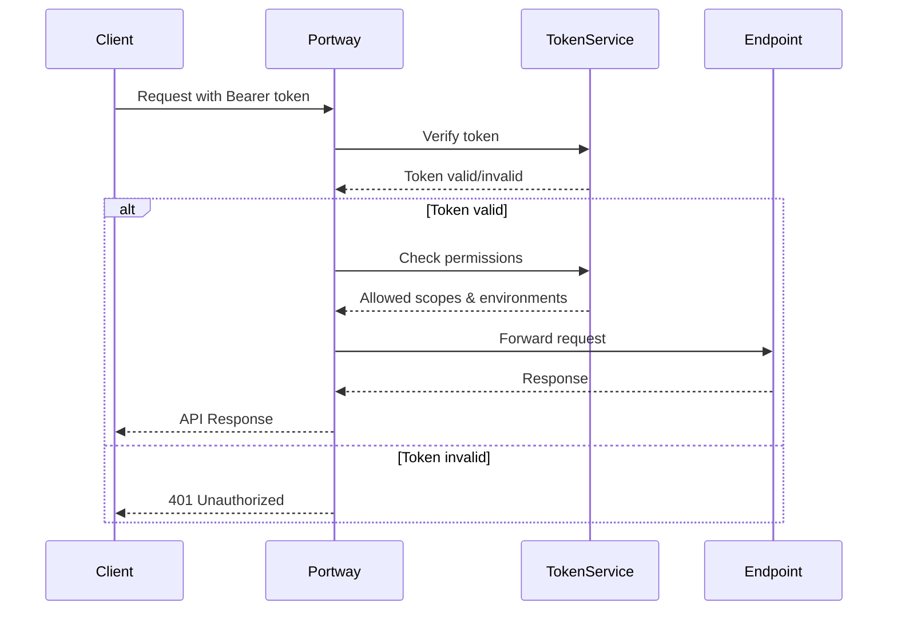

# Authentication

Portway uses token-based authentication to secure API access. This reference guide covers token management, authentication headers, and scope-based access control.

## Token Authentication Overview

All API requests require authentication using bearer tokens:

```http
Authorization: Bearer your_token_here
```

:::warning Required for All API Calls
Authentication is required for all API endpoints except `/health/live`. Requests without valid tokens receive a 401 Unauthorized response.
:::

## Token Properties

Each token has the following properties:

| Property | Description | Default |
|----------|-------------|---------|
| `username` | Unique identifier for the token | Required |
| `tokenHash` | Cryptographic hash of the token | Auto-generated |
| `tokenSalt` | Salt for token hashing | Auto-generated |
| `createdAt` | Token creation timestamp | Current time |
| `expiresAt` | Optional expiration date | `null` (never expires) |
| `revokedAt` | Revocation timestamp | `null` (active) |
| `allowedScopes` | Endpoint access permissions | `*` (all endpoints) |
| `allowedEnvironments` | Environment access permissions | `*` (all environments) |
| `description` | Token purpose/description | Empty |

## Authentication Flow



## Token Generation

Tokens are generated using the TokenGenerator tool:

```bash
# Generate token with default settings
TokenGenerator.exe username

# Generate token with specific scopes
TokenGenerator.exe username -s "Products,Orders"

# Generate token with environment restrictions
TokenGenerator.exe username -e "prod,staging"

# Generate token with expiration
TokenGenerator.exe username --expires 90
```

## Token File Format

Generated tokens are stored in JSON files:

```json
{
  "Username": "api-service",
  "Token": "your-secure-token-here",
  "AllowedScopes": "Products,Orders",
  "AllowedEnvironments": "600,700",
  "ExpiresAt": "2024-04-15 10:30:00",
  "CreatedAt": "2024-01-15 10:30:00",
  "Description": "API access for service X",
  "Usage": "Use this token in the Authorization header as: Bearer your-secure-token-here"
}
```

## Scope-Based Access Control

### Endpoint Scopes

Control access to specific endpoints:

| Scope Pattern | Description | Example |
|--------------|-------------|---------|
| `*` | Access to all endpoints | Default |
| `Products` | Access to Products endpoint only | Single endpoint |
| `Products,Orders` | Access to multiple endpoints | Comma-separated |
| `Product*` | Access to endpoints starting with "Product" | Wildcard |

### Environment Scopes

Control access to specific environments:

| Scope Pattern | Description | Example |
|--------------|-------------|---------|
| `*` | Access to all environments | Default |
| `600` | Access to environment 600 only | Single environment |
| `600,700` | Access to multiple environments | Comma-separated |
| `6*` | Access to environments starting with "6" | Wildcard |

## Token Security

### Hashing Algorithm

Tokens are secured using PBKDF2 with SHA256:

- 10,000 iterations
- 256-bit output
- Random 128-bit salt per token
- Stored hash, not plaintext

### Security Best Practices

:::tip Token Security Checklist
1. Never store tokens in source code
2. Use environment variables for tokens
3. Rotate tokens regularly
4. Use minimal required scopes
5. Set expiration dates for temporary access
6. Revoke compromised tokens immediately
7. Use separate tokens per service/application
:::

## Authentication Errors

### Common Error Responses

| Status | Error | Cause |
|--------|-------|-------|
| 401 | "Authentication required" | Missing Authorization header |
| 401 | "Invalid or expired token" | Token invalid, expired, or revoked |
| 403 | "Access denied to endpoint" | Token lacks endpoint permission |
| 403 | "Access denied to environment" | Token lacks environment permission |

### Error Response Format

```json
{
  "success": false,
  "error": "Access denied to endpoint 'Products'",
  "availableScopes": "Orders,Customers",
  "requestedEndpoint": "Products"
}
```

## Token Management

### Managing Tokens via TokenGenerator

```bash
# List all active tokens
TokenGenerator.exe
> Option 1

# Revoke a token
TokenGenerator.exe
> Option 3
> Enter token ID

# Update token scopes
TokenGenerator.exe
> Option 4
> Enter new scopes

# Update token expiration
TokenGenerator.exe
> Option 6
> Enter days until expiration
```

### Token Lifecycle

1. **Generation**: Create token with specific permissions
2. **Distribution**: Share token file securely
3. **Usage**: Include in API requests
4. **Rotation**: Generate new token before expiration
5. **Revocation**: Invalidate compromised tokens

## Advanced Authentication

### Custom Headers

While Portway uses standard bearer authentication, you can add custom headers for tracking:

```http
Authorization: Bearer your_token_here
X-Client-ID: service-name
X-Request-ID: correlation-id
```

### Token Validation Process

1. Extract token from Authorization header
2. Verify token against hashed database entry
3. Check token expiration
4. Verify token hasn't been revoked
5. Validate endpoint access scope
6. Validate environment access scope
7. Proceed with request or return error

## Troubleshooting Authentication

### Common Issues

1. **"Missing or invalid authentication header"**
   ```http
   # Incorrect
   Authorization: your_token_here
   
   # Correct
   Authorization: Bearer your_token_here
   ```

2. **"Token lacks permission for endpoint"**
   - Check token's `allowedScopes`
   - Verify endpoint name matches exactly
   - Update token scopes if needed

3. **"Token expired"**
   - Generate new token
   - Implement token rotation
   - Check `expiresAt` in token file

4. **"Invalid token format"**
   - Ensure token is copied completely
   - Check for extra whitespace
   - Verify token hasn't been truncated

### Debug Authentication Issues

1. Check token validity:
   ```bash
   TokenGenerator.exe
   > Option 1 (List tokens)
   ```

2. Verify token permissions:
   ```json
   # Check token file
   {
     "AllowedScopes": "Products,Orders",
     "AllowedEnvironments": "600,700"
   }
   ```

3. Test with minimal request:
   ```bash
   curl -H "Authorization: Bearer your_token_here" \
        https://api.company.com/health
   ```

## Best Practices

### Token Rotation Strategy

1. Set reasonable expiration periods
2. Generate new tokens before expiry
3. Overlap old and new tokens briefly
4. Update services with new tokens
5. Revoke old tokens after transition

### Secure Token Storage

:::warning Never Store Tokens In
- Source code repositories
- Client-side JavaScript
- Public configuration files
- Unencrypted databases
- Log files
:::

:::tip Secure Storage Options
- Environment variables
- Secure key vaults
- Encrypted configuration
- CI/CD secrets management
:::

## Related Topics

- [HTTP Headers](/reference/http-headers) - Additional header configuration
- [Security Guide](/guide/security) - Comprehensive security practices
- [Token Generator](/reference/tools/token-generator) - Token management tool
- [API Overview](/reference/api/overview) - General API reference