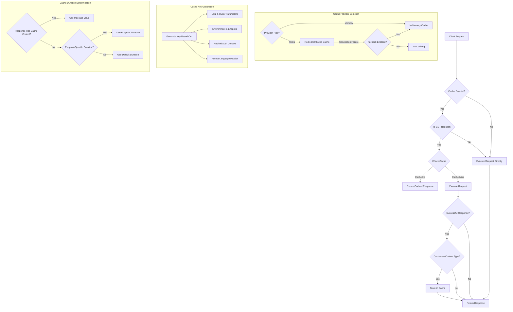

# Caching

Portway implements a flexible caching system that supports both in-memory and Redis distributed caching. This provides improved performance, reduced load on backend systems, and enhanced scalability for high-traffic deployments. The caching system seamlessly handles responses from proxied endpoints, SQL queries, and other operations.

## Caching Flow

The diagram below illustrates the decision flow for caching in Portway, showing how requests are processed, when caching is applied, and how cache providers are selected:



## Providers

Portway offers two different caching providers to suit various deployment scenarios and performance requirements. Each provider has distinct characteristics that make it suitable for different use cases.

### In-Memory Cache
The in-memory cache is the default option that provides fast, local caching with minimal setup:

- Default caching mechanism with no external dependencies
- Stores cached items in the application's memory
- Ideal for single-instance deployments
- Fastest response times for cached content
- Cache is lost on application restart

### Redis Distributed Cache
For more robust, enterprise deployments, the Redis distributed cache offers advanced features:

- Enterprise-grade distributed caching
- Persistence across application restarts
- Cross-instance cache sharing for load-balanced deployments
- Configurable memory limits and eviction policies
- Advanced monitoring capabilities

## Cache Configuration

Portway's caching system offers extensive configuration options to tailor caching behavior to your specific requirements. The following tables detail the available settings and their default values.

| Setting | Description | Default |
|---------|-------------|---------|
| Enabled | Master switch to enable/disable caching | true |
| ProviderType | Cache provider: "Memory" or "Redis" | Memory |
| DefaultCacheDurationSeconds | Default cache lifetime in seconds | 300 |
| MemoryCacheMaxItems | Maximum items in memory cache | 10,000 |
| MemoryCacheSizeLimitMB | Memory cache size limit | 100 |
| EndpointCacheDurations | Per-endpoint cache durations | varies |
| CacheableContentTypes | Content types eligible for caching | application/json, text/xml |

### Redis-Specific Settings

When using Redis as your cache provider, these additional settings allow fine-tuning of the Redis connection and behavior:

| Setting | Description | Default |
|---------|-------------|---------|
| ConnectionString | Redis server connection string | localhost:6379 |
| InstanceName | Prefix for Redis keys | Portway: |
| Database | Redis database number | 0 |
| UseSsl | Enable SSL for Redis connection | false |
| ConnectTimeoutMs | Connection timeout in milliseconds | 5000 |
| FallbackToMemoryCache | Use memory cache if Redis fails | true |
| MaxRetryAttempts | Max retry attempts for Redis operations | 3 |
| RetryDelayMs | Delay between retries in milliseconds | 200 |

## Behavior

Understanding what gets cached and what doesn't is crucial for optimizing your caching strategy. The following sections explain the caching rules implemented in Portway.

### What Gets Cached
Portway's caching system selectively caches responses based on the following criteria:

- GET requests to proxy endpoints
- GET requests to SQL endpoints
- Responses with cacheable content types
- Successful responses (status codes 2xx)

### What Doesn't Get Cached
Certain types of requests and responses are deliberately excluded from caching:

- POST, PUT, DELETE, PATCH requests
- SOAP requests and responses
- Error responses (status codes 4xx, 5xx)
- Requests with authentication-specific caching rules
- Non-cacheable content types

### Cache Keys
The system generates unique cache keys based on multiple factors to ensure proper cache isolation. Keys are automatically generated based on:

- Request URL and query parameters
- Environment and endpoint name
- Authentication context (securely hashed)
- Accept-Language header

## Cache Durations

Portway provides flexible options for controlling how long items remain in the cache. This allows you to balance performance with data freshness based on your specific needs.

### Default Duration
All cacheable responses are stored for the configured DefaultCacheDurationSeconds (default: 300 seconds / 5 minutes).

### Per-Endpoint Durations
You can configure custom durations for specific endpoints to match their data volatility patterns:

```json
"EndpointCacheDurations": {
  "Products": 600,
  "Categories": 3600,
  "Customers": 300
}
```

### Cache-Control Overrides
Responses with explicit Cache-Control headers will use their max-age value instead of the default or per-endpoint settings:

```
Cache-Control: public, max-age=600
```

## Cache Management

Effective cache management ensures your system maintains optimal performance while serving fresh data. Portway provides several mechanisms for cache control and monitoring.

### Cache Invalidation
Cache entries are automatically invalidated under the following conditions:

- After their configured duration expires
- When a non-GET operation is performed on the same endpoint
- When the application restarts (memory cache only)

### Visualization
Portway provides visibility into cache operations through detailed logging, helping you understand and troubleshoot cache behavior:

```
📋 Cache hit for proxy request: Products, URL: http://api.example.com/products
🔍 Cache miss for proxy request: Orders, URL: http://api.example.com/orders
💾 Cached proxy response for: Customers (300 seconds)
```

### Statistics
The health endpoint `/health/details` provides comprehensive cache statistics to help monitor performance:

- Current cache size and item count
- Hit/miss ratio
- Memory usage
- Connection status for Redis

## Performance Impact

Caching significantly improves system performance, but it's important to understand the trade-offs. This section outlines the performance characteristics of Portway's caching system.

### Cache Hit On Performance
The performance improvement varies by cache provider:

- In-memory: 10-20x faster than uncached requests
- Redis: 5-10x faster than uncached requests

### Memory Usage
Different cache providers have different memory management characteristics:

- In-memory: Configurable with MemoryCacheSizeLimitMB
- Redis: Managed by Redis server, configurable through Redis configuration

### Network Impact
Network overhead depends on the cache provider:

- In-memory: No network overhead
- Redis: Adds minor network latency (typically 1-3ms)

## High-Availability Configuration

For production environments with demanding uptime requirements, Portway supports high-availability caching configurations. These options ensure your caching layer remains resilient and performant even under failure conditions.

### Redis Sentinel Support
For high-availability Redis deployments, you can configure Redis Sentinel to provide automatic failover:

```json
"Redis": {
  "ConnectionString": "sentinel-master-name,sentinel1:26379,sentinel2:26379",
  "InstanceName": "Portway:",
  "Database": 0
}
```

### Redis Cluster Support
For horizontally scalable Redis deployments that can handle larger datasets and higher throughput:

```json
"Redis": {
  "ConnectionString": "redis1:6379,redis2:6379,redis3:6379",
  "InstanceName": "Portway:",
  "Database": 0
}
```

### Fallback Behavior
Portway implements sophisticated fallback mechanisms when Redis connectivity issues occur. When Redis is unavailable and FallbackToMemoryCache is enabled:

- Automatically switches to in-memory caching
- Logs warning message
- Periodically attempts to reconnect to Redis
- Seamlessly returns to Redis when connection is restored

## Security Considerations

Caching systems can introduce security considerations that should be addressed in your deployment. This section outlines key security aspects to consider.

### Redis Security
Redis has minimal security by default, so additional measures are recommended for production:

- Redis has no authentication by default
- Enable Redis authentication for production
- Configure SSL for encrypted connections
- Apply network-level security (VPC, firewall rules)

### Sensitive Data
Portway implements several measures to protect sensitive information in the cache:

- Authorization tokens are hashed before use in cache keys
- Sensitive headers are not cached
- Response content is stored as-is, review data sensitivity

### Redis Configuration
Production deployments should configure Redis with these security measures:

- Redis authentication (password)
- Binding to specific network interfaces
- Memory limits and eviction policies
- SSL certificate configuration (if using SSL)

## Monitoring and Troubleshooting

Effective monitoring and troubleshooting are essential for maintaining a healthy caching system. Portway provides tools and information to help identify and resolve cache-related issues.

### Cache Health Check
Portway includes a health check endpoint that provides detailed Redis status information:

```json
{
  "status": "Healthy",
  "tags": ["cache", "redis", "readiness"],
  "data": {
    "127.0.0.1:6379": {
      "redis_version": "7.0.11",
      "uptime_in_seconds": "86400",
      "connected_clients": "5",
      "used_memory_human": "15.50M"
    }
  }
}
```

### Common Issues

When troubleshooting caching problems, consider these common issues and their solutions:

1. **Redis Connection Failures**
   - Check Redis server is running
   - Verify connection string
   - Ensure network connectivity
   - Check for firewall blocking

2. **Cache Not Working**
   - Verify Caching:Enabled is true
   - Check endpoint is using GET method
   - Verify content type is in CacheableContentTypes
   - Look for cache-related log entries

3. **High Memory Usage**
   - Reduce DefaultCacheDurationSeconds
   - Lower MemoryCacheMaxItems
   - Configure Redis maxmemory and eviction policy
   - Consider caching fewer endpoints

### Diagnostic Commands

When troubleshooting Redis-specific issues, these commands can help diagnose problems:

```
# Check Redis connection
redis-cli ping

# Monitor cache operations in real-time
redis-cli monitor

# See memory usage
redis-cli info memory

# View cache keys
redis-cli keys "Portway:*"

# Check TTL for a specific key
redis-cli ttl "Portway:proxy:600:Products::"
```

## Performance Optimization

Optimizing your caching strategy can significantly improve application performance. This section provides guidance on tuning your cache configuration for maximum benefit.

### Optimizing Cache Efficiency
To get the most from your caching implementation, consider these strategies:

- Cache high-frequency, low-change-rate endpoints
- Set appropriate cache durations based on data volatility
- Consider caching at multiple levels (API gateway, CDN)

### Cache Duration Strategy
Different types of data benefit from different caching durations:

- Static reference data: Long duration (hours)
- Frequently accessed data: Medium duration (minutes) 
- User-specific data: Short duration (seconds)
- Time-sensitive data: Very short duration or no caching

### Redis Performance Tuning
When using Redis as your cache provider, these optimizations can improve performance:

- Enable Redis persistence for critical data
- Configure appropriate maxmemory-policy
- Use pipelining for batch operations
- Consider Redis cluster for high throughput

## Best Practices

Following these best practices will help you implement and maintain an effective caching strategy with Portway.

### 1. Cache Selection
Choose the right caching provider for your deployment scenario:

- Use in-memory caching for single instances
- Use Redis for multi-instance deployments
- Enable FallbackToMemoryCache for reliability

### 2. Cache Duration
Set appropriate cache durations to balance performance with data freshness:

- Set appropriate durations per endpoint
- Consider data volatility in duration settings
- Use longer durations for static data

### 3. Content Types
Configure which content types should be cached:

- Cache JSON and XML responses by default
- Add other content types as needed
- Exclude binary data unless necessary

### 4. Monitoring
Implement proper monitoring to ensure cache health:

- Regular health checks
- Track cache hit/miss rates
- Monitor memory usage
- Watch for Redis connection issues

## Scaling Considerations

As your system grows, your caching strategy may need to evolve. This section outlines key considerations for scaling your caching implementation.

### Horizontal Scaling
When adding more application instances, consider these caching implications:

- Redis provides cross-instance caching
- In-memory cache requires sticky sessions

### Vertical Scaling
To handle more data without adding instances:

- Increase MemoryCacheSizeLimitMB for larger datasets
- Configure Redis memory limits appropriately

### Geographic Distribution
For globally distributed applications:

- Consider Redis replicas for read-scaling
- Use Redis cluster for geo-distributed deployments
- Configure regional Redis instances for multi-region deployments
