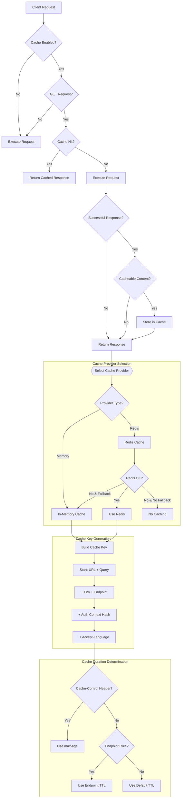

# Caching

> Configuration reference for Portway's in-memory and Redis caching.

Portway caches GET responses from SQL and Proxy endpoints to reduce backend load. Only `2xx` responses with cacheable content types are stored.

## Cache Flow


```mermaid
flowchart TD
    A[Client Request] --> B{Cache Enabled?}
    B -->|No| G[Execute Request]
    B -->|Yes| C{GET Request?}

    C -->|No| G
    C -->|Yes| D{Cache Hit?}

    D -->|Yes| E[Return Cached Response]
    D -->|No| F[Execute Request]

    F --> H{Successful Response?}
    H -->|No| K[Return Response]
    H -->|Yes| I{Cacheable Content?}

    I -->|No| K
    I -->|Yes| J[Store in Cache]
    J --> K

    K --> L{{Select Cache Provider}}

    subgraph "Cache Provider Selection"
        direction TB
        L --> L1{Provider Type?}
        L1 -->|Memory| M[In-Memory Cache]
        L1 -->|Redis| N[Redis Cache]

        N --> O{Redis OK?}
        O -->|Yes| NOK[Use Redis]
        O -->|No & Fallback| M
        O -->|No & No Fallback| P[No Caching]
    end

    M & NOK --> Q[Build Cache Key]

    subgraph "Cache Key Generation"
        direction TB
        Q --> R[Start: URL + Query]
        R --> S[+ Env + Endpoint]
        S --> T[+ Auth Context Hash]
        T --> U[+ Accept-Language]
    end

    U --> V{Cache-Control Header?}

    subgraph "Cache Duration Determination"
        direction TB
        V -->|Yes| W[Use max-age]
        V -->|No| X{Endpoint Rule?}
        X -->|Yes| Y[Use Endpoint TTL]
        X -->|No| Z[Use Default TTL]
    end
```

## Providers

| Provider | Use case |
|----------|----------|
| `Memory` | Single-instance deployments. Fastest; cache lost on restart. |
| `Redis` | Multi-instance or load-balanced deployments. Persists across restarts; shared across instances. |

## Configuration

```json
{
  "Caching": {
    "Enabled": true,
    "DefaultCacheDurationSeconds": 300,
    "ProviderType": "Memory",
    "MemoryCacheMaxItems": 10000,
    "MemoryCacheSizeLimitMB": 100,
    "CacheableContentTypes": [
      "application/json",
      "text/json"
    ],
    "EndpointCacheDurations": {
      "Products": 600,
      "Customers": 300
    }
  }
}
```

### Property Reference

| Property | Type | Default | Description |
|----------|------|---------|-------------|
| `Enabled` | boolean | `true` | Enable response caching |
| `DefaultCacheDurationSeconds` | integer | `300` | Default TTL for cached responses |
| `ProviderType` | string | `"Memory"` | Cache backend: `"Memory"` or `"Redis"` |
| `MemoryCacheMaxItems` | integer | `10000` | Maximum number of items in memory cache |
| `MemoryCacheSizeLimitMB` | integer | `100` | Memory cap in MB |
| `CacheableContentTypes` | array | `["application/json", ...]` | Only cache responses with these content types |
| `EndpointCacheDurations` | object | `{}` | Per-endpoint TTL overrides keyed by endpoint name |

### Redis Configuration

```json
{
  "Caching": {
    "ProviderType": "Redis",
    "Redis": {
      "ConnectionString": "localhost:6379",
      "InstanceName": "Portway:",
      "Database": 0,
      "UseSsl": false,
      "ConnectTimeoutMs": 5000,
      "AbortOnConnectFail": false,
      "FallbackToMemoryCache": true,
      "MaxRetryAttempts": 3,
      "RetryDelayMs": 200
    }
  }
}
```

| Property | Type | Default | Description |
|----------|------|---------|-------------|
| `ConnectionString` | string | `"localhost:6379"` | Redis connection string |
| `InstanceName` | string | `"Portway:"` | Key prefix for all cache entries |
| `Database` | integer | `0` | Redis logical database index |
| `UseSsl` | boolean | `false` | Use TLS for the Redis connection |
| `ConnectTimeoutMs` | integer | `5000` | Connection timeout in milliseconds |
| `AbortOnConnectFail` | boolean | `false` | Throw on connection failure instead of retrying |
| `FallbackToMemoryCache` | boolean | `true` | Fall back to in-process memory cache if Redis is unavailable |
| `MaxRetryAttempts` | integer | `3` | Retry attempts on transient Redis errors |
| `RetryDelayMs` | integer | `200` | Delay between retry attempts in milliseconds |

## Cache Behaviour

### What is cached

- GET requests to SQL and Proxy endpoints
- Responses with content types listed in `CacheableContentTypes`
- Successful responses (`2xx` status codes)

### What is not cached

- POST, PUT, DELETE, PATCH requests
- Error responses (`4xx`, `5xx`)
- Responses with non-cacheable content types

### Cache keys

Keys are generated from: request URL + query string, environment and endpoint name, hashed authentication context, and `Accept-Language` header.

### Cache invalidation

Cache entries expire after their configured TTL. A non-GET operation on the same endpoint also invalidates its cache entries. Memory cache is cleared on application restart; Redis persists.

## Cache Durations

All cacheable responses use `DefaultCacheDurationSeconds` unless overridden. Override specific endpoints with `EndpointCacheDurations`:

```json
"EndpointCacheDurations": {
  "Products": 600,
  "Categories": 3600,
  "Customers": 300
}
```

Responses with an explicit `Cache-Control: max-age=N` header use that value instead.

## High-Availability Redis

### Sentinel

```json
"Redis": {
  "ConnectionString": "sentinel-master-name,sentinel1:26379,sentinel2:26379",
  "InstanceName": "Portway:"
}
```

### Cluster

```json
"Redis": {
  "ConnectionString": "redis1:6379,redis2:6379,redis3:6379",
  "InstanceName": "Portway:"
}
```

When `FallbackToMemoryCache` is `true` and Redis becomes unavailable, Portway switches to in-memory caching automatically and logs a warning. It resumes Redis caching when the connection is restored.

## Cache Statistics

`GET /health/details` includes cache statistics: item count, hit/miss ratio, memory usage, and Redis connection status.

## Troubleshooting

### Redis diagnostic commands

```
redis-cli ping
redis-cli info memory
redis-cli keys "Portway:*"
redis-cli ttl "Portway:proxy:600:Products::"
```

### Common issues

| Symptom | Likely cause | Fix |
|---------|-------------|-----|
| Cache not working | `Caching.Enabled` is false, or non-GET request | Set `Enabled: true`; confirm it's a GET |
| Content type not cached | Not in `CacheableContentTypes` | Add the content type |
| Redis connection failures | Wrong connection string or unreachable server | Verify `ConnectionString`; check firewall |
| High memory usage | Long TTL or too many items | Reduce `DefaultCacheDurationSeconds` or `MemoryCacheMaxItems` |

## Related Topics

- [Monitoring](/guide/monitoring) — cache configuration via the Web UI
- [Application Settings](/reference/app-settings) — full `appsettings.json` reference
