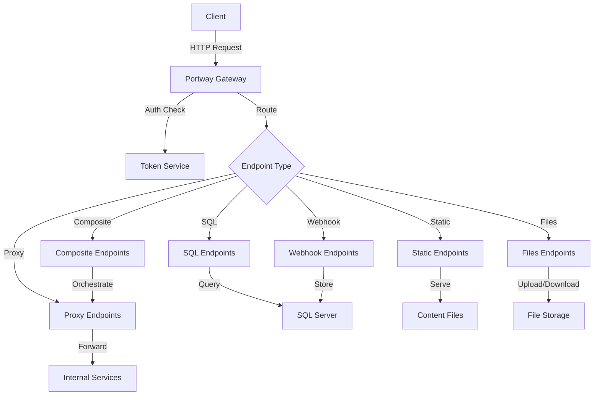

# API Reference Overview

This reference guide covers all aspects of interacting with Portway's API, from authentication to documentation & advanced query operations.

## API Architecture

Portway follows a RESTful architecture with endpoint patterns that mirror your business logic:


:::info
**Note:** Advanced configuration such as the various caching strategies are not depicted in the diagram above, since this overview focuses on a high-level API flow.
:::

## Base URL Structure

All Portway endpoints follow this pattern:

```
https://your-domain.com/api/{environment}/{endpoint}
```

| Component | Description | Example |
|-----------|-------------|---------|
| `{environment}` | Target environment | `600`, `700`, `prod` |
| `{endpoint}` | Endpoint name | `Products`, `Orders` |

## Endpoint Types

### SQL Endpoints
Direct access to SQL Server data with OData query support.

```http
GET /api/600/Products?$filter=Assortment eq 'Books'&$top=10
```

### Proxy Endpoints
Forward requests to internal web services.

```http
GET /api/700/Accounts
POST /api/700/Orders
```

### Static Endpoints
Serve static content files with optional OData filtering.

```http
GET /api/600/ProductionMachine?$top=1&$filter=status eq 'running'
```

### Composite Endpoints
Orchestrate multiple operations in a single request.

```http
POST /api/600/SalesOrder
```

### Webhook Endpoints
Receive and store external webhook data.

```http
POST /api/600/webhook/webhook1
```

### Files Endpoints
Handle file upload, download, and management operations organized by file categories.

```http
POST /api/600/files/CustomerData
GET /api/600/files/CustomerData/{fileId}
DELETE /api/600/files/CustomerData/{fileId}
GET /api/600/files/CustomerData/list

POST /api/600/files/Documents
GET /api/600/files/Documents/{fileId}
DELETE /api/600/files/Documents/{fileId}
GET /api/600/files/Documents/list

POST /api/600/files/Images
GET /api/600/files/Images/{fileId}
DELETE /api/600/files/Images/{fileId}
GET /api/600/files/Images/list
```

## Authentication Flow

All requests must include a valid bearer token:

```http
Authorization: Bearer your_token_here
```

:::tip Authentication Best Practices
1. Use service-specific tokens with minimal required scopes
2. Implement token rotation for enhanced security
3. Store tokens securely - never in source code
4. Use environment variables or secure vaults
:::

## Request/Response Format

Portway uses JSON for both request and response bodies:

### Request Example
```json
{
  "CustomerCode": "CUST001",
  "OrderDate": "2024-01-15",
  "Items": [
    {
      "ProductCode": "PROD001",
      "Quantity": 5
    }
  ]
}
```

### Response Example
```json
{
  "success": true,
  "data": {
    "OrderId": "ORD-12345",
    "Status": "Created"
  }
}
```

## Common Response Codes

| Code | Meaning | Description |
|------|---------|-------------|
| 200 | OK | Request successful |
| 201 | Created | Resource created successfully |
| 400 | Bad Request | Invalid request format or parameters |
| 401 | Unauthorized | Missing or invalid authentication token |
| 403 | Forbidden | Token lacks required permissions |
| 404 | Not Found | Endpoint or resource not found |
| 429 | Too Many Requests | Rate limit exceeded |
| 500 | Server Error | Internal server error |

## Error Response Format

All errors follow a consistent structure:

```json
{
  "success": false,
  "error": "Error message",
  "errorDetail": "Detailed error information",
  "timestamp": "2024-01-15T10:30:00Z"
}
```

## Rate Limiting

Portway implements rate limiting to ensure fair usage:

| Limit Type | Default | Header |
|------------|---------|--------|
| Per IP | 100/minute | `X-RateLimit-IP-Remaining` |
| Per Token | 1000/minute | `X-RateLimit-Token-Remaining` |

:::warning Rate Limit Response
When rate limited, you'll receive a 429 status with:
```json
{
  "error": "Too many requests",
  "retryAfter": "2024-01-15T10:31:00Z"
}
```
:::

## Query Parameters

Common query parameters supported across endpoints:

| Parameter | Type | Description | Example |
|-----------|------|-------------|---------|
| `$select` | string | Select specific fields | `$select=Name,Price` |
| `$filter` | string | Filter results | `$filter=Price gt 100` |
| `$orderby` | string | Sort results | `$orderby=Name desc` |
| `$top` | integer | Limit results | `$top=50` |
| `$skip` | integer | Skip results | `$skip=20` |

## Content Negotiation

Portway supports content negotiation through headers:

```http
Accept: application/json
Content-Type: application/json
```

## API Versioning

While Portway doesn't use explicit versioning, backward compatibility is maintained. Breaking changes are communicated in advance.

## Health Check Endpoints

Monitor API availability:

| Endpoint | Description | Auth Required |
|----------|-------------|---------------|
| `/health/live` | Basic liveness check | No |
| `/health` | Detailed health status | Yes |
| `/health/details` | Component-level health | Yes |

## Troubleshooting

### Common Issues

1. **401 Unauthorized**
   - Verify token is included in Authorization header
   - Check token hasn't expired
   - Ensure "Bearer" prefix is present

2. **403 Forbidden**
   - Verify token has required scopes
   - Check environment access permissions
   - Confirm endpoint allows your token's permissions

3. **404 Not Found**
   - Verify endpoint name spelling
   - Check environment is correct
   - Ensure endpoint is configured

4. **500 Server Error**
   - Check server logs for details
   - Verify database connectivity
   - Ensure proper configuration

### Debug Headers

Include these headers for enhanced debugging:

```http
X-Debug-Mode: true
X-Correlation-ID: unique-request-id
```

## Next Steps

- Learn about [Authentication](/reference/authentication) in detail
- Explore [HTTP Headers](/reference/http-headers) usage
- Understand [OData Syntax](/reference/query-language/odata-syntax) for queries
- Review [Entity Configuration](/reference/configuration/entity-configuration)

:::tip API Testing
Use tools like Postman or curl to test endpoints. OpenAPI documentation is available at `/docs` for interactive API exploration.
:::