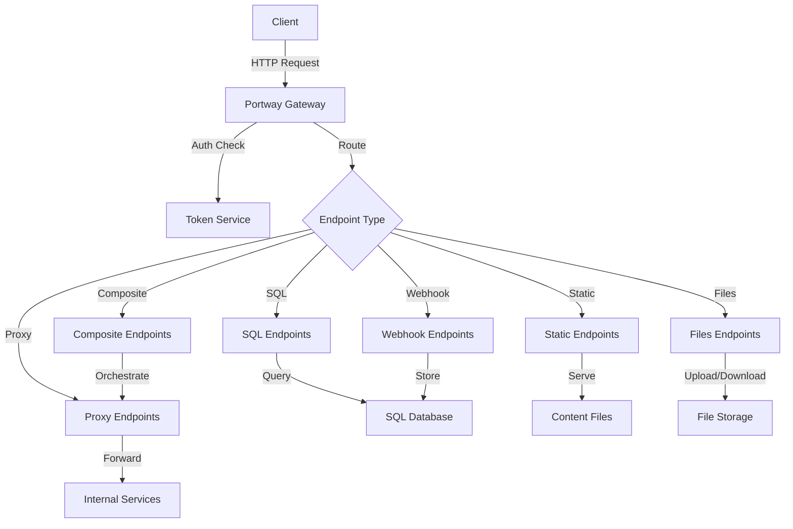

# API Reference

This is the map of Portway's API surface: routes, endpoint types, response codes, and the query parameters available to you. If you're integrating a client, this page and its siblings are where you'll find the contract.

All requests follow this URL pattern:

```
/api/{environment}/{endpoint}
```

The `{environment}` segment maps to a folder under `environments/`. The `{endpoint}` segment matches a configured endpoint name, or `{namespace}/{endpoint}` for namespaced endpoints.

## Request Flow


```mermaid
graph TD
    A[Client] -->|HTTP Request| B[Portway Gateway]
    B -->|Auth Check| C[Token Service]
    B -->|Route| D{Endpoint Type}
    D -->|SQL| E[SQL Endpoints]
    D -->|Proxy| F[Proxy Endpoints]
    D -->|Static| M[Static Endpoints]
    D -->|Composite| G[Composite Endpoints]
    D -->|Webhook| H[Webhook Endpoints]
    D -->|Files| K[Files Endpoints]
    E -->|Query| I[SQL Database]
    F -->|Forward| J[Internal Services]
    M -->|Serve| N[Content Files]
    G -->|Orchestrate| F
    H -->|Store| I
    K -->|Upload/Download| L[File Storage]
```

## Endpoint Types

| Type | URL Pattern | Description |
|------|-------------|-------------|
| SQL | `/api/{env}/{endpoint}` | OData-queryable access to database tables, views, or stored procedures |
| Proxy | `/api/{env}/{endpoint}` | Forwards requests to internal web services |
| Static | `/api/{env}/{endpoint}` | Serves pre-defined content files |
| Composite | `/api/{env}/{endpoint}` | Orchestrates multiple proxy operations in a single request |
| Webhook | `/api/{env}/webhook/{name}` | Receives and stores external webhook payloads |
| Files | `/api/{env}/files/{name}` | Handles file upload, download, and listing |

## Authentication

Include a bearer token on every request:

```http
Authorization: Bearer your_token_here
```

Requests without a valid token return `401 Unauthorized`. The only unauthenticated endpoint is `/health/live`. See [Authentication](/reference/api-auth) for token scope configuration.

## Response Codes

| Code | Meaning |
|------|---------|
| 200 | OK |
| 201 | Created |
| 400 | Bad Request: invalid format or query parameters |
| 401 | Unauthorized: missing or invalid token |
| 403 | Forbidden: token lacks the required scope or environment access |
| 404 | Not Found: endpoint or resource does not exist |
| 429 | Too Many Requests: rate limit exceeded |
| 500 | Internal Server Error |

## Error Format

Every endpoint type answers errors with the same small envelope, so you can handle failures the same way everywhere:

```json
{
  "success": false,
  "error": "A human-readable message"
}
```

Validation failures (`422`) add a `details` array describing each problem:

```json
{
  "success": false,
  "error": "Validation failed",
  "details": [
    { "field": "Price", "message": "is required" }
  ]
}
```

In the API reference these appear as the shared `ErrorResponse` and `ValidationErrorResponse` schemas, which every operation references.

## Status Codes by Endpoint Type

Every endpoint type shares the same error envelope, but each returns only the codes that make sense for it. This is the set you will see documented per operation in the API reference:

| Endpoint type | Success | Error codes |
|---------------|---------|-------------|
| SQL (read) | `200` | `400` `401` `403` `404` `500` |
| SQL (write) | `200` `201` | `400` `401` `403` `404` `422` `500` |
| Proxy | pass-through | `400` `401` `403` `404` `500` |
| Static | `200` | `400` `401` `403` `404` `406` `500` |
| Composite | `200` | `400` `401` `403` `404` `422` `500` |
| Webhook | `200` | `400` `401` `403` `404` `500` |
| Files | `200` `201` `206` | `400` `401` `403` `404` `409` `413` `415` `416` `500` |

A `429 Too Many Requests` can come back from any endpoint when a rate limit is exceeded. `400` covers both a malformed request and an environment that is not on the allowed list; `403` means the token is valid but lacks the scope, or the target was blocked.

The success body, on the other hand, is specific to each endpoint. SQL queries return your rows, Static endpoints return their configured content, File downloads return bytes, and Proxy and Composite endpoints pass through whatever the upstream service or the final step returns. SQL stored procedures are the freest of all: they shape their own payloads. The reference documents the success shape it can infer for each operation, so treat the error contract as universal and the success contract as per endpoint.

## OData Query Parameters

SQL and Static endpoints support OData query parameters:

| Parameter | Type | Description | Example |
|-----------|------|-------------|---------|
| `$select` | string | Select specific fields | `$select=Name,Price` |
| `$filter` | string | Filter results | `$filter=Price gt 100` |
| `$orderby` | string | Sort results | `$orderby=Name desc` |
| `$top` | integer | Maximum items to return | `$top=50` |
| `$skip` | integer | Items to skip (pagination) | `$skip=20` |

## Rate Limiting

| Limit | Default | Response header |
|-------|---------|-----------------|
| Per IP | 100 / minute | `X-RateLimit-IP-Remaining` |
| Per Token | 1000 / minute | `X-RateLimit-Token-Remaining` |

Rate-limited requests receive `429 Too Many Requests`.

## Health Endpoints

| Endpoint | Auth required | Description |
|----------|--------------|-------------|
| `/health/live` | No | Liveness check for load balancers |
| `/health` | Yes | Basic health status |
| `/health/details` | Yes | Per-component health with database and proxy checks |

## Next Steps

- [Authentication](/reference/api-auth): token properties and scope patterns
- [OData Syntax](/reference/odata): filter, sort, and pagination
- [Entity Configuration](/reference/entity-config): endpoint configuration reference
- [HTTP Headers](/reference/headers): request and response headers
