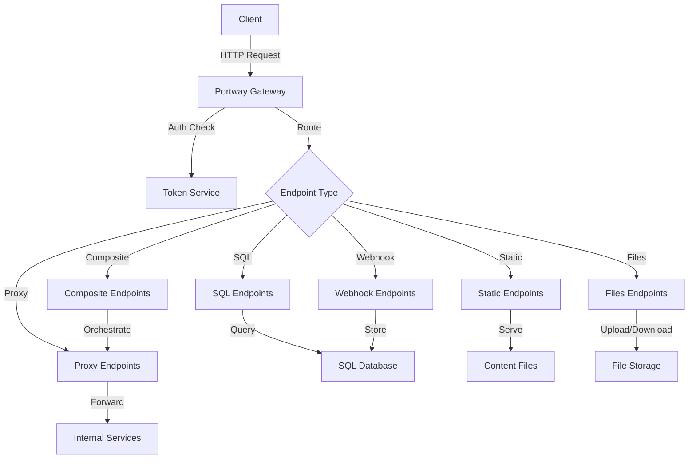

# API Reference

This is the map of Portway's API surface: routes, endpoint types, response codes, and the query parameters available to you. If you're integrating a client, this page and its siblings are where you'll find the contract.

All requests follow this URL pattern:

```
/api/{environment}/{endpoint}
```

The `{environment}` segment maps to a folder under `environments/`. The `{endpoint}` segment matches a configured endpoint name, or `{namespace}/{endpoint}` for namespaced endpoints.

## Request flow


```mermaid
graph TD
    A[Client] -->|HTTP Request| B[Portway Gateway]
    B -->|Auth Check| C[Token Service]
    B -->|Route| D{Endpoint Type}
    D -->|SQL| E[SQL Endpoints]
    D -->|Proxy| F[Proxy Endpoints]
    D -->|Static| M[Static Endpoints]
    D -->|Composite| G[Composite Endpoints]
    D -->|Webhook| H[Webhook Endpoints]
    D -->|Files| K[Files Endpoints]
    E -->|Query| I[SQL Database]
    F -->|Forward| J[Internal Services]
    M -->|Serve| N[Content Files]
    G -->|Orchestrate| F
    H -->|Store| I
    K -->|Upload/Download| L[File Storage]
```

## Endpoint types

Most endpoints live under a namespace, which becomes the first path segment:

| Type | URL Pattern | Description |
|------|-------------|-------------|
| SQL | `/api/{env}/{namespace}/{endpoint}` | OData-queryable access to database tables, views, or stored procedures |
| Proxy | `/api/{env}/{namespace}/{endpoint}` | Forwards requests to internal web services |
| Static | `/api/{env}/{namespace}/{endpoint}` | Serves pre-defined content files |
| Composite | `/api/{env}/{namespace}/{endpoint}` | Orchestrates multiple proxy operations in a single request |
| Webhook | `/api/{env}/{namespace}/{name}/{id}` | Receives and stores external webhook payloads |
| Files | `/api/{env}/files/{name}` | Handles file upload, download, and listing |

## Authentication

Include a bearer token on every request:

```http
Authorization: Bearer your_token_here
```

Requests without a valid token return `401 Unauthorized`. The only unauthenticated endpoint is `/health/live`. See [Authentication](/reference/api-auth) for token scope configuration.

## Response codes

| Code | Meaning |
|------|---------|
| 200 | OK |
| 201 | Created |
| 400 | Bad Request: invalid format or query parameters |
| 401 | Unauthorized: missing or invalid token |
| 403 | Forbidden: token lacks the required scope or environment access |
| 404 | Not Found: endpoint or resource does not exist |
| 429 | Too Many Requests: rate limit exceeded |
| 500 | Internal Server Error |

## Error format

Every endpoint type answers errors with the same small envelope, so you can handle failures the same way everywhere:

```json
{
  "success": false,
  "error": "A human-readable message"
}
```

Validation failures (`422`) add a `details` array describing each problem:

```json
{
  "success": false,
  "error": "Validation failed",
  "details": [
    { "field": "Price", "message": "is required" }
  ]
}
```

In the API reference these appear as the shared `ErrorResponse` and `ValidationErrorResponse` schemas, which every operation references.

A `500` carries one extra field, `traceId`. The message itself stays deliberately vague, so this identifier is what ties your response back to the matching entry in the server log. It is worth quoting whenever you report a problem:

```json
{
  "success": false,
  "error": "Error processing. Please check the logs for more details.",
  "traceId": "00-530e2d01e7e446f7c1a9936cd2858df4-77e01a3151145562-02"
}
```

## Status codes by endpoint type

Every endpoint type shares the same error envelope, but each returns only the codes that make sense for it. This is the set you will see documented per operation in the API reference:

| Endpoint type | Success | Error codes |
|---------------|---------|-------------|
| SQL (read) | `200` | `400` `401` `403` `404` `500` `503` |
| SQL (write) | `200` `201` | `400` `401` `403` `404` `422` `500` `503` |
| SQL (query) | `200` | `400` `401` `403` `404` `415` `500` `503` |
| Proxy | pass-through | `400` `401` `403` `404` `500` `503` |
| Static | `200` | `400` `401` `403` `404` `406` `500` `503` |
| Composite | `200` | `400` `401` `403` `404` `422` `500` `503` |
| Webhook | `200` | `400` `401` `403` `404` `500` `503` |
| Files | `200` `201` `206` | `400` `401` `403` `404` `409` `413` `415` `416` `500` `503` |

A `429 Too Many Requests` can come back from any endpoint when a rate limit is exceeded. A `503` tells you the endpoint has been switched off through `Enabled: false`, and it arrives with a `Retry-After` header so you know how long to wait. `400` covers both a malformed request and an environment that is not on the allowed list; `403` means the token is valid but lacks the scope, or the target was blocked.

The success body, on the other hand, is specific to each endpoint:

- SQL queries return your rows
- Static endpoints return their configured content
- File downloads return bytes
- Proxy and Composite endpoints pass through whatever the upstream service or the final step returns
- SQL stored procedures are the freest of all, shaping their own payloads

The reference documents the success shape it can infer for each operation. In short, the error contract is universal and the success contract is per endpoint.

## OData query parameters


SQL and Static endpoints accept `$select`, `$filter`, `$orderby`, `$top`, `$skip` and `$count`.

```http
GET /api/prod/Products?$select=Name,Price&$filter=Price gt 100&$orderby=Name desc&$top=50
```

See [OData syntax](/reference/odata) for the full option reference and [Filter operations](/reference/filters) for the operator set.

## Rate limiting


Requests are limited per IP and per token, and every response carries the `X-RateLimit-*` headers describing the applicable budget. Exceeding a limit returns `429 Too Many Requests` with a `Retry-After` header.

Defaults, per-token overrides and Redis-backed buckets are covered in [Rate limiting](/guide/rate-limiting). The header set is listed in [HTTP headers](/reference/headers).

## Health endpoints


`/health/live` is an unauthenticated liveness probe for load balancers. `/health` and `/health/details` require a token and report component status. See [Health checks](/reference/health-checks).

## Next steps

- [Authentication](/reference/api-auth): token properties and scope patterns
- [OData Syntax](/reference/odata): filter, sort, and pagination
- [Entity Configuration](/reference/entity-config): endpoint configuration reference
- [HTTP Headers](/reference/headers): request and response headers
