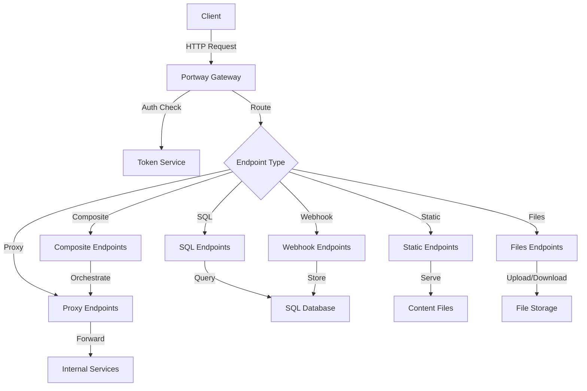

# API Reference

Routes, endpoint types, response codes and query options of the Portway API.

URL pattern:

```
/api/{environment}/{endpoint}
```

The environment segment selects a folder under `environments/`; the endpoint segment is the endpoint name, or `{namespace}/{endpoint}` for namespaced endpoints.

## Request flow


```mermaid
graph TD
    A[Client] -->|HTTP Request| B[Portway Gateway]
    B -->|Auth Check| C[Token Service]
    B -->|Route| D{Endpoint Type}
    D -->|SQL| E[SQL Endpoints]
    D -->|Proxy| F[Proxy Endpoints]
    D -->|Static| M[Static Endpoints]
    D -->|Composite| G[Composite Endpoints]
    D -->|Webhook| H[Webhook Endpoints]
    D -->|Files| K[Files Endpoints]
    E -->|Query| I[SQL Database]
    F -->|Forward| J[Internal Services]
    M -->|Serve| N[Content Files]
    G -->|Orchestrate| F
    H -->|Store| I
    K -->|Upload/Download| L[File Storage]
```

## Endpoint types

Namespaced URL patterns (the namespace segment is optional):

| Type | URL Pattern | Description |
|------|-------------|-------------|
| SQL | `/api/{env}/{namespace}/{endpoint}` | OData-queryable access to database tables, views, or stored procedures |
| Proxy | `/api/{env}/{namespace}/{endpoint}` | Forwards requests to internal web services |
| Static | `/api/{env}/{namespace}/{endpoint}` | Serves pre-defined content files |
| Composite | `/api/{env}/{namespace}/{endpoint}` | Orchestrates multiple proxy operations in a single request |
| Webhook | `/api/{env}/{namespace}/{name}/{id}` | Receives and stores external webhook payloads |
| Files | `/api/{env}/files/{name}` | Handles file upload, download, and listing |

## Authentication

Bearer token on every request:

```http
Authorization: Bearer your_token_here
```

Requests without a valid token return `401`. Unauthenticated paths: `/health`, `/health/live` and the Prometheus scrape path. Token scopes: [Authentication](/reference/api-auth).

## Response codes

| Code | Meaning |
|------|---------|
| 200 | OK |
| 201 | Created |
| 400 | Invalid request, query or tenant header |
| 401 | Missing or invalid token |
| 403 | Token scope, environment or tenant excludes the request |
| 404 | Endpoint or record not found |
| 429 | Rate limit exceeded |
| 500 | Internal Server Error |

## Error format

Errors share one envelope on every endpoint type:

```json
{
  "success": false,
  "error": "A human-readable message"
}
```

Validation failures (`422`) add a `details` array:

```json
{
  "success": false,
  "error": "Validation failed",
  "details": [
    { "field": "Price", "message": "is required" }
  ]
}
```

The OpenAPI document defines them as `ErrorResponse` and `ValidationErrorResponse`.

A `500` adds `traceId`, which identifies the matching server log entry:

```json
{
  "success": false,
  "error": "Error processing. Please check the logs for more details.",
  "traceId": "00-530e2d01e7e446f7c1a9936cd2858df4-77e01a3151145562-02"
}
```

## Status codes by endpoint type

Status codes documented per operation:

| Endpoint type | Success | Error codes |
|---------------|---------|-------------|
| SQL (read) | `200` | `400` `401` `403` `404` `500` `503` |
| SQL (write) | `200` `201` | `400` `401` `403` `404` `422` `500` `503` |
| SQL (query) | `200` | `400` `401` `403` `404` `415` `500` `503` |
| Proxy | pass-through | `400` `401` `403` `404` `500` `503` |
| Static | `200` | `400` `401` `403` `404` `406` `500` `503` |
| Composite | `200` | `400` `401` `403` `404` `422` `500` `503` |
| Webhook | `201` | `400` `401` `403` `404` `500` `503` |
| Files | `200` `201` `206` | `400` `401` `403` `404` `409` `413` `415` `416` `500` `503` |

Any endpoint can return `429`. A `503` with `Retry-After` means the endpoint is disabled (`Enabled: false`).

| Endpoint type | Success body |
|---|---|
| SQL read | Rows |
| SQL stored procedure | Procedure result |
| Static | Configured content |
| File download | File bytes |
| Proxy, Composite | Upstream or final step response |

## OData query parameters

SQL and Static endpoints accept `$select`, `$filter`, `$orderby`, `$top`, `$skip` and `$count`.

```http
GET /api/prod/Products?$select=Name,Price&$filter=Price gt 100&$orderby=Name desc&$top=50
```

Options: [OData syntax](/reference/odata). Operators: [Filter operations](/reference/filters).

## Rate limiting

Requests are limited per IP address and per token. Responses include `X-RateLimit-*` headers; `429` responses include `Retry-After`. Configuration: [Rate limiting](/guide/rate-limiting). Headers: [HTTP headers](/reference/headers).

## Health endpoints

The paths `/health` and `/health/live` are unauthenticated; `/health/details` requires a token. Details: [Health checks](/reference/health-checks).

## Next steps

- [Authentication](/reference/api-auth)
- [OData Syntax](/reference/odata)
- [Entity Configuration](/reference/entity-config)
- [HTTP Headers](/reference/headers)
