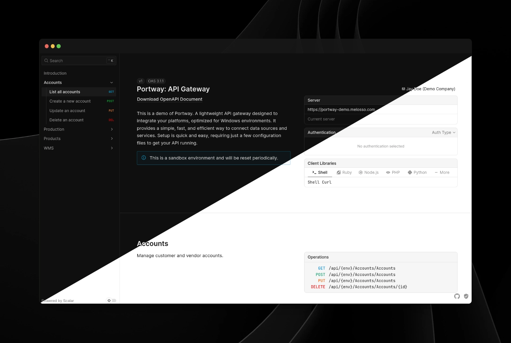

#   Portway

[](LICENSE)
[](https://github.com/melosso/portway/commits/main)
[](https://github.com/melosso/portway/releases/latest)

Portway is a lightweight **API gateway** for Windows and Linux containers that simplifies secure service routing and infrastructure management.

It unifies databases, internal services, and webhooks into a single interface using simple, file-based configuration. Built-in caching, audit logging, and automated documentation keep your data flow reliable and easy to control.

Out of the box, Portway handles proxy pass-through, SQL endpoints, and webhooks, with native support for MCP and OData. It also includes Azure Key Vault authentication, rate limiting, management (web) console and full observability through Prometheus or any OTLP collector.

<div>
      <p align="center">
        <strong>🔍 <a href="https://portway-demo.melosso.com/">See it in action!</a></strong>
      </p>
</div>




---

## Prerequisites

Before deploying Portway, make sure your environment meets the following requirements. These ensure full functionality across all features, especially SQL and authentication.

* .NET Hosting Bundle
  * Preview >= `v0.7.0`: <a href="https://dotnet.microsoft.com/en-us/download/dotnet/11.0" target="_blank" rel="noopener noreferrer">.NET 11</a> (currently a preview)
  * Production: <a href="https://dotnet.microsoft.com/en-us/download/dotnet/10.0" target="_blank" rel="noopener noreferrer">.NET 10 LTS</a> build remains available
* If you're running on Windows: Internet Information Services (IIS)
* A supported SQL database (if you're using SQL endpoints): SQL Server, PostgreSQL, MySQL/MariaDB, or SQLite

Ready to go? Then lets continue:

## Getting Started

Follow these steps to get Portway up and running in your environment. Setup is fast and modular, making it easy to configure just what you need.

### 1. Download & Extract

#### Windows Server (Recommended)

Grab the <a href="https://github.com/melosso/portway/releases" target="_blank" rel="noopener noreferrer">latest release</a> and extract it to your deployment folder. This build already includes a set of example environment and endpoint configurations. 

Note, before configuring the application in Internet Information Services, make sure to configure your environment-specific secret:

```powershell
$bytes = New-Object byte[] 48; [Security.Cryptography.RandomNumberGenerator]::Create().GetBytes($bytes); [Environment]::SetEnvironmentVariable("PORTWAY_ENCRYPTION_KEY", [Convert]::ToBase64String($bytes), "Machine")
```

On containerized environments, this can be done with the identically named `PORTWAY_ENCRYPTION_KEY` variable.

---

#### **Alternative: Docker Compose**

You can quickly deploy Portway using Docker Compose and the official image:

```yaml
services:
  portway:
    image: ghcr.io/melosso/portway:latest
    ports:
      - "8080:8080"
    volumes:
      - portway_app:/app
      - ./environments:/app/environments
      - ./endpoints:/app/endpoints
      - ./tokens:/app/tokens
      - ./log:/app/log
      - ./data:/app/data
    environment:
      # Set your encryption secret here (e.g. use openssl rand -hex 32)
      - PORTWAY_ENCRYPTION_KEY=YourEncryptionKeyHere

      # Configure CORS, prefix and access token
      - AllowedHosts=*
      - PathBase=
      - WebUi__AdminApiKey=INSECURE-CHANGE-ME-admin-api-key

volumes:
  portway_app:
```

Then run:

```sh
docker compose pull && docker compose up -d
```

This will start Portway on port [8080](#) and mount your configuration folders. Adjust paths and ports as needed for your environment. Before you can start using the API, you'll have to configure your environment settings and endpoint configurations.

### 2. Define Your Environments

Define your server and environment settings to isolate the various environments you may require (e.g. `prod` and `dev`). These configurations are used across the endpoints that you'll configure later on. First configure the allowed environments, after which the individual environment has to be defined:

**`environments/settings.json`**

```json
{
  "Environment": {
    "ServerName": "localhost",
    "AllowedEnvironments": ["prod", "dev"]
  }
}
```

**`environments/prod/settings.json`**

```json
{
  "ServerName": "localhost",
  "ConnectionString": "Server=localhost;Database=prod;Trusted_Connection=True;Connection Timeout=5;TrustServerCertificate=true;"
}
```

### 3. Define Your Endpoints

Endpoints are configured as JSON files. Each type has its own directory and format, making them easy to manage and extend. These are plain examples, for more advanced configuration you may have to read our extensive documentation on our <a href="https://melosso.github.io/portway/" target="_blank" rel="noopener noreferrer">documentation page</a>. There are various types that Portway supports:

* **SQL** (SQL Server, PostgreSQL, MySQL, SQLite): Direct CRUD access with schema-level control and documentation
* **Proxy**: Forward to internal services; supports complex orchestration
* **Composite**: Chain multiple endpoint calls into one transaction
* **File System**: Read/write from local storage or cache (In memory and/or Redis)
* **Webhook**: Receive external calls and persist data to SQL
* **Static**: read static files or set up a mock endpoint

These are handled seperately below. Once configured, the request side of each type is shown under [Examples](#examples).

<br>

<details>
<summary>SQL Endpoints</summary>
These point straight at your database tables. You choose which columns get exposed and what their public names should be. It keeps the surface area clean and lets you hide internal schemas or naming quirks.

#### Example — `endpoints/SQL/Products/entity.json`

```json
{
  "DatabaseObjectName": "Items",
  "DatabaseSchema": "dbo",
  "PrimaryKey": "ItemCode",
  "AllowedColumns": [
    "ItemCode;ProductNumber",
    "LongDescription;Description",
    "Assortment;AssortmentCode",
    "sysguid;InternalID"
  ],
  "AllowedEnvironments": ["prod", "dev"]
}
```

</details>
<br>
<details>
<summary>Proxy Endpoints</summary>
These just pass the call through to another service. It’s basically a small reverse proxy where you decide which HTTP verbs you want to support.

#### Example — `endpoints/Proxy/Accounts/entity.json`

```json
{
  "Url": "http://localhost:8020/services/Exact.Entity.REST.EG/Account",
  "Methods": ["GET", "POST", "PUT", "DELETE", "MERGE"],
  "AllowedEnvironments": ["prod", "dev"]
}
```

</details>
<br>
<details>
<summary>Composite Endpoints</summary>
These help when a single logical action actually means “call a bunch of other endpoints in a specific order.” Think of creating an order with multiple lines and a header. You wire the steps together and the engine handles the sequencing.

#### Example — `endpoints/Proxy/SalesOrder/entity.json`

```json
{
  "Type": "Composite",
  "Url": "http://localhost:8020/services/Exact.Entity.REST.EG",
  "Methods": ["POST"],
  "CompositeConfig": {
    "Name": "SalesOrder",
    "Description": "Creates a complete sales order with multiple lines and header",
    "Steps": [
      {
        "Name": "CreateOrderLines",
        "Endpoint": "SalesOrderLine",
        "Method": "POST",
        "IsArray": true,
        "ArrayProperty": "Lines",
        "TemplateTransformations": {
          "TransactionKey": "$guid"
        }
      },
      {
        "Name": "CreateOrderHeader",
        "Endpoint": "SalesOrderHeader",
        "Method": "POST",
        "SourceProperty": "Header",
        "TemplateTransformations": {
          "TransactionKey": "$prev.CreateOrderLines.0.d.TransactionKey"
        }
      }
    ]
  }
}
```

</details>
<br>
<details>
<summary>Static Endpoints</summary>
Sometimes you just want to serve a file. JSON, XML, CSV, whatever. These endpoints expose static content and can still use OData filtering if you turn it on.

#### Example — `endpoints/Static/ProductionMachine/entity.json`

```json
{
  "ContentType": "application/xml",
  "ContentFile": "summary.xml",
  "EnableFiltering": true,
  "AllowedEnvironments": ["prod", "dev"]
}
```

</details>
<br>
<details>
<summary>Files Endpoints</summary>
This is for storing or retrieving actual files rather than rows or JSON. Handy for documents, images, exports.

#### Example — `endpoints/Files/Documents/entity.json`

```json
{
  "StorageType": "Local",
  "BaseDirectory": "documents",
  "AllowedExtensions": [".pdf", ".docx", ".xlsx", ".txt"],
  "AllowedEnvironments": ["prod", "dev"]
}
```

</details>
<br>
<details>
<summary>Webhook Endpoints</summary>
When an external service needs to push data into your system, this is the entry point. The payload goes straight into your table of choice.

#### Example — `endpoints/Webhooks/Integrations/Inbound/entity.json`

```json
{
  "DatabaseObjectName": "WebhookData",
  "DatabaseSchema": "dbo",
  "AllowedColumns": ["webhook1", "webhook2"]
}
```

</details>

### 4. Deploy

When you're ready to host in IIS or Docker, follow the <a href="https://melosso.github.io/portway/guide/deployment" target="_blank" rel="noopener noreferrer">deployment guide</a>. It covers application pool identity (needed for NTLM proxy scenarios), security settings, and production hardening.

---

## Security

Portway uses a lightweight token-based system for authentication. Include the token in request headers, with the Bearer prefix included:

```bash
Authorization: Bearer YOUR_TOKEN_HERE
```

The first-run token file, scope control, Azure Key Vault, secret encryption at rest, and application identity for NTLM scenarios are covered in the <a href="https://melosso.github.io/portway/guide/security" target="_blank" rel="noopener noreferrer">security guide</a>.

---

## Examples

Here are some common requests you'll make using Portway's endpoints.

<details>
<summary>SQL</summary>

<br>

Query specific data with full OData support:

```bash
GET /api/prod/Products?$filter=Assortment eq 'Books'&$select=ItemCode,Description
````

</details>

<details>
<summary>Proxy</summary>

<br>

Forward calls to internal REST services:

```bash
GET /api/prod/Accounts
POST /api/prod/Accounts
```

</details>

<details>
<summary>Composite</summary>

<br>

Chain together multiple operations into one:

```bash
POST /api/prod/composite/SalesOrder
Content-Type: application/json
{
  "Header": {
    "OrderDebtor": "60093",
    "YourReference": "Connect async"
  },
  "Lines": [
    { "Itemcode": "ITEM-001", "Quantity": 2, "Price": 0 },
    { "Itemcode": "ITEM-002", "Quantity": 4, "Price": 0 }
  ]
}
```

</details>

<details>
<summary>Static</summary>

<br>

Serve static content with optional OData filtering:

```bash
GET /api/prod/ProductionMachine?$top=1&$filter=status eq 'running'
Accept: application/xml
```

</details>

<details>
<summary>Files</summary>

<br>

Upload, list, and download files:

```bash
POST /api/prod/files/Documents
Content-Type: multipart/form-data
file=@report.pdf

GET /api/prod/files/Documents/list
GET /api/prod/files/Documents/abc123fileId
```

</details>

<details>
<summary>Webhooks</summary>

<br>

Receive data from external services:

```bash
POST /api/prod/Integrations/Inbound/webhook1
Content-Type: application/json
{
  "eventType": "order.created",
  "data": {
    "orderId": "12345",
    "customer": "ACME Corp"
  }
}
```

</details>

You'll find comprehensive configuration examples in our <a href="https://melosso.github.io/portway/" target="_blank" rel="noopener noreferrer">documentation page</a>.

## Documentation

We allow you to expose the API with a configurable documentation endpoint. This can be disabled if necessary. 

### Interactive documentation
The application uses <a href="https://github.com/scalar/scalar" target="_blank" rel="noopener noreferrer">Scalar</a> to render your OpenAPI specification as interactive API documentation. Access it at `/docs` to explore endpoints, test requests, and view response schemas, which are all generated automatically from your endpoint configurations.

### Model Context Protocol (MCP)
The application also can act as a MCP server over HTTP. Your endpoints can appear in the MCP tool registry and becomes callable by any MCP-compatible client, e.g. Mistral, VS Code Copilot, custom agents, or the built-in Chat UI. Beware that this is opt-in, meaning all endpoints are not exposed as tool by default. Portway's own authentication and environment scoping apply to every tool call. Please read more on MCP integration at <a href="https://melosso.github.io/portway/guide/mcp" target="_blank" rel="noopener noreferrer">MCP documentation</a>.

### Walkthrough
Our <a href="https://melosso.github.io/portway/" target="_blank" rel="noopener noreferrer">documentation page</a> will walk you through setting up Portway. This covers both basic usage, and advanced configuration. Feel free to submit a pull request if you'd like to see changes to the documentation.

## Contribution 

Contributions are welcome, please submit a PR if you'd like to help improve the project.

## License

Licensed under the **EUPL-1.2**. For more information, please see the [license](LICENSE) file.