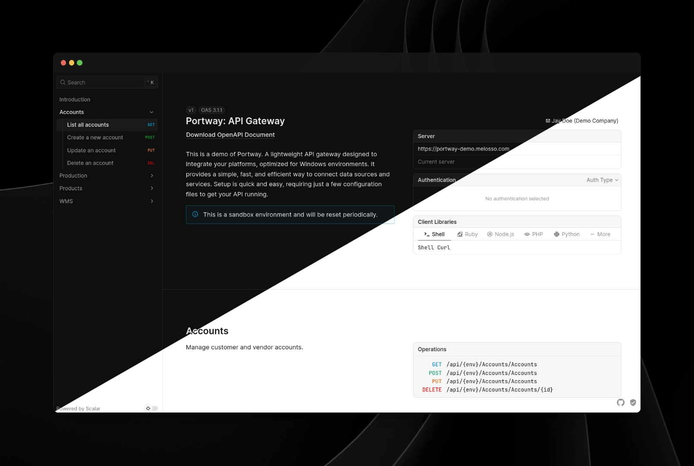

#   Portway

[](LICENSE)
[](https://github.com/melosso/portway/commits/main)
[](https://github.com/melosso/portway/releases/latest)

Portway is a lightweight **API gateway** that simplifies secure service routing and infrastructure management.

It unifies databases, internal services, and webhooks into a single interface using simple, file-based configuration. Caching, audit logging and generated documentation are built in.

Portway serves proxy, SQL and webhook endpoints with MCP and OData support, plus Azure Key Vault secrets, rate limiting, a management console and metrics through Prometheus or any OTLP collector.

<div>
      <p align="center">
        <strong>🔍 <a href="https://portway-demo.melosso.com/">See it in action!</a></strong>
      </p>
</div>




---

## Prerequisites

Requirements:

* .NET Hosting Bundle: <a href="https://get.dot.net/11" target="_blank" rel="noopener noreferrer">.NET 11</a>
* Windows: Internet Information Services (IIS)
* *Optional*: a supported SQL database: SQL Server, PostgreSQL, MySQL/MariaDB, or SQLite

## Getting Started

### 1. Download & Extract

#### Windows Server (IIS)

Download the <a href="https://github.com/melosso/portway/releases" target="_blank" rel="noopener noreferrer">latest release</a> and extract it to your deployment folder. The build includes example environment and endpoint configurations.

Set the encryption key before configuring the site in IIS:

```powershell
$bytes = New-Object byte[] 48; [Security.Cryptography.RandomNumberGenerator]::Create().GetBytes($bytes); [Environment]::SetEnvironmentVariable("PORTWAY_ENCRYPTION_KEY", [Convert]::ToBase64String($bytes), "Machine")
```

On containerized environments, this can be done with the identically named `PORTWAY_ENCRYPTION_KEY` variable.

---

#### **Docker Compose**

You can quickly deploy Portway using Docker Compose and the official image:

```yaml
services:
  portway:
    image: ghcr.io/melosso/portway:latest
    ports:
      - "8080:8080"
    volumes:
      - portway_app:/app
      - ./environments:/app/environments
      - ./endpoints:/app/endpoints
      - ./tokens:/app/tokens
      - ./log:/app/log
      - ./data:/app/data
    environment:
      # Set your encryption secret here (e.g. use openssl rand -hex 32)
      - PORTWAY_ENCRYPTION_KEY=YourEncryptionKeyHere

      # Configure CORS, prefix and access token
      - PORTWAY_ALLOWED_HOSTS=*
      - PORTWAY_PATH_BASE=
      - PORTWAY_ADMIN_KEY=INSECURE-CHANGE-ME-admin-api-key

volumes:
  portway_app:
```

Then run:

```sh
docker compose pull && docker compose up -d
```

Portway listens on port 8080 with the configuration folders mounted. The API requires environment and endpoint configuration before first use.

### 2. Define Your Environments

Environments (e.g. `prod`, `dev`) isolate server and connection settings for all endpoints. `environments/settings.json` lists the allowed environments; each has its own `settings.json`:

**`environments/settings.json`**

```json
{
  "Environment": {
    "ServerName": "localhost",
    "AllowedEnvironments": ["prod", "dev"]
  }
}
```

**`environments/prod/settings.json`**

```json
{
  "ServerName": "localhost",
  "ConnectionString": "Server=localhost;Database=prod;Trusted_Connection=True;Connection Timeout=5;TrustServerCertificate=true;"
}
```

### 3. Define Your Endpoints

Each endpoint is an `entity.json` file in a directory per type. Advanced configuration is in the <a href="https://melosso.github.io/portway/" target="_blank" rel="noopener noreferrer">documentation</a>. Endpoint types:

* **SQL** (SQL Server, PostgreSQL, MySQL, SQLite): Direct CRUD access with schema-level control and documentation
* **Proxy**: Forward to internal services; supports complex orchestration
* **Composite**: Chain multiple endpoint calls into one transaction
* **File System**: Read/write from local storage or cache (In memory and/or Redis)
* **Webhook**: Receive external calls and persist data to SQL
* **Static**: read static files or set up a mock endpoint

Requests for each type are listed under [Examples](#examples).

<br>

<details>
<summary>SQL Endpoints</summary>
Map to a database table or view. `AllowedColumns` sets the exposed columns and their public names.

#### Example — `endpoints/SQL/Products/entity.json`

```json
{
  "DatabaseObjectName": "Items",
  "DatabaseSchema": "dbo",
  "PrimaryKey": "ItemCode",
  "AllowedColumns": [
    "ItemCode;ProductNumber",
    "LongDescription;Description",
    "Assortment;AssortmentCode",
    "sysguid;InternalID"
  ],
  "AllowedEnvironments": ["prod", "dev"]
}
```

</details>
<br>
<details>
<summary>Proxy Endpoints</summary>
Forward requests to another service, limited to the configured HTTP methods.

#### Example — `endpoints/Proxy/Accounts/entity.json`

```json
{
  "Url": "http://localhost:8020/services/Exact.Entity.REST.EG/Account",
  "Methods": ["GET", "POST", "PUT", "DELETE", "MERGE"],
  "AllowedEnvironments": ["prod", "dev"]
}
```

</details>
<br>
<details>
<summary>Composite Endpoints</summary>
These help when a single logical action actually means “call a bunch of other endpoints in a specific order.” Think of creating an order with multiple lines and a header. You wire the steps together and the engine handles the sequencing.

#### Example — `endpoints/Proxy/SalesOrder/entity.json`

```json
{
  "Type": "Composite",
  "Url": "http://localhost:8020/services/Exact.Entity.REST.EG",
  "Methods": ["POST"],
  "CompositeConfig": {
    "Name": "SalesOrder",
    "Description": "Creates a complete sales order with multiple lines and header",
    "Steps": [
      {
        "Name": "CreateOrderLines",
        "Endpoint": "SalesOrderLine",
        "Method": "POST",
        "IsArray": true,
        "ArrayProperty": "Lines",
        "TemplateTransformations": {
          "TransactionKey": "$guid"
        }
      },
      {
        "Name": "CreateOrderHeader",
        "Endpoint": "SalesOrderHeader",
        "Method": "POST",
        "SourceProperty": "Header",
        "TemplateTransformations": {
          "TransactionKey": "$prev.CreateOrderLines.0.d.TransactionKey"
        }
      }
    ]
  }
}
```

</details>
<br>
<details>
<summary>Static Endpoints</summary>
Serve static JSON, XML or CSV content, with optional OData filtering.

#### Example — `endpoints/Static/ProductionMachine/entity.json`

```json
{
  "ContentType": "application/xml",
  "ContentFile": "summary.xml",
  "EnableFiltering": true,
  "AllowedEnvironments": ["prod", "dev"]
}
```

</details>
<br>
<details>
<summary>Files Endpoints</summary>
Store and retrieve files such as documents, images and exports.

#### Example — `endpoints/Files/Documents/entity.json`

```json
{
  "StorageType": "Local",
  "BaseDirectory": "documents",
  "AllowedExtensions": [".pdf", ".docx", ".xlsx", ".txt"],
  "AllowedEnvironments": ["prod", "dev"]
}
```

</details>
<br>
<details>
<summary>Webhook Endpoints</summary>
Receive inbound calls from external services and write the payload to a table.

#### Example — `endpoints/Webhooks/Webhooks/Incoming/entity.json`

```json
{
  "DatabaseObjectName": "WebhookData",
  "DatabaseSchema": "dbo",
  "AllowedColumns": ["webhook1", "webhook2"]
}
```

</details>

### 4. Deploy

When you're ready to host in IIS or Docker, follow the <a href="https://melosso.github.io/portway/guide/deployment" target="_blank" rel="noopener noreferrer">deployment guide</a>. It covers application pool identity (needed for NTLM proxy scenarios), security settings, and production hardening.

---

## Security

Portway uses a lightweight token-based system for authentication. Include the token in request headers, with the Bearer prefix included:

```bash
Authorization: Bearer YOUR_TOKEN_HERE
```

The first-run token file, scope control, Azure Key Vault, secret encryption at rest, and application identity for NTLM scenarios are covered in the <a href="https://melosso.github.io/portway/guide/security" target="_blank" rel="noopener noreferrer">security guide</a>.

---

## Examples

Common requests per endpoint type.

<details>
<summary>SQL</summary>

<br>

Query specific data with full OData support:

```bash
GET /api/prod/Products?$filter=Assortment eq 'Books'&$select=ItemCode,Description
````

</details>

<details>
<summary>Proxy</summary>

<br>

Forward calls to internal REST services:

```bash
GET /api/prod/Accounts
POST /api/prod/Accounts
```

</details>

<details>
<summary>Composite</summary>

<br>

Chain together multiple operations into one:

```bash
POST /api/prod/composite/SalesOrder
Content-Type: application/json
{
  "Header": {
    "OrderDebtor": "60093",
    "YourReference": "Connect async"
  },
  "Lines": [
    { "Itemcode": "ITEM-001", "Quantity": 2, "Price": 0 },
    { "Itemcode": "ITEM-002", "Quantity": 4, "Price": 0 }
  ]
}
```

</details>

<details>
<summary>Static</summary>

<br>

Serve static content with optional OData filtering:

```bash
GET /api/prod/ProductionMachine?$top=1&$filter=status eq 'running'
Accept: application/xml
```

</details>

<details>
<summary>Files</summary>

<br>

Upload, list, and download files:

```bash
POST /api/prod/files/Documents
Content-Type: multipart/form-data
file=@report.pdf

GET /api/prod/files/Documents/list
GET /api/prod/files/Documents/abc123fileId
```

</details>

<details>
<summary>Webhooks</summary>

<br>

Receive data from external services:

```bash
POST /api/prod/Webhooks/Incoming/webhook1
Content-Type: application/json
{
  "eventType": "order.created",
  "data": {
    "orderId": "12345",
    "customer": "ACME Corp"
  }
}
```

</details>

More configuration examples are in the <a href="https://melosso.github.io/portway/" target="_blank" rel="noopener noreferrer">documentation page</a>.

## Documentation

The API documentation endpoint is configurable and can be disabled.

### Interactive documentation
The application uses <a href="https://github.com/scalar/scalar" target="_blank" rel="noopener noreferrer">Scalar</a> to render your OpenAPI specification as interactive API documentation. `/docs` lists endpoints, request and response schemas and a request client, generated from the endpoint configuration.

### Model Context Protocol (MCP)
Portway is an MCP server over HTTP. Endpoints with MCP enabled are tools for any MCP client (e.g. Mistral, VS Code Copilot, custom agents or the built-in chat). MCP is opt-in per endpoint. Token authentication and environment scoping apply to every tool call. See the <a href="https://melosso.github.io/portway/guide/mcp" target="_blank" rel="noopener noreferrer">MCP documentation</a>.

### Walkthrough
The <a href="https://melosso.github.io/portway/" target="_blank" rel="noopener noreferrer">documentation</a> covers setup, basic usage and advanced configuration. Documentation changes are accepted as pull requests.

## Contribution 

Contributions are welcome, please submit a PR if you'd like to help improve the project.

## License

Licensed under the **EUPL-1.2**. For more information, please see the [license](LICENSE) file.
